# Lab 1 & 2 实验报告

## Lab1

### 一. 实验内容

#### 1.1 实现二选一数据选择器（分别使用数据流描述、门级描述、两种行为描述）

#### 1.2 利用设计好的二选一数据选择器模块，实现四选一数据选择器

### 二. 实验步骤

#### 2.1 电路图设计

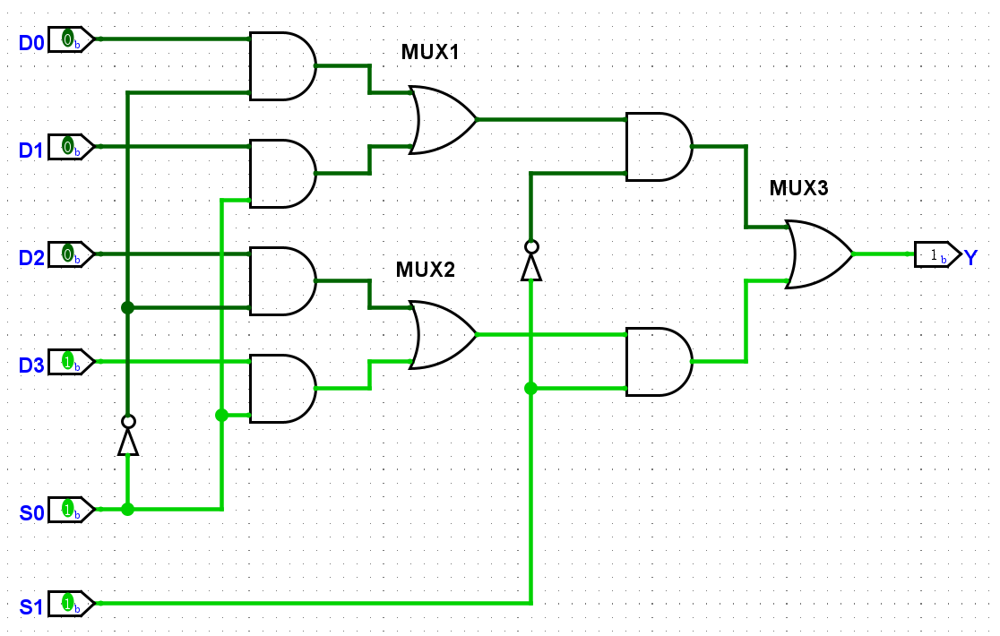

#### 2.2 代码设计

2.2.1 二选一数据选择器

```verilog
module mux2to1(A, B, S, Y);
    // 输入输出定义
    input A, B, S;
    output Y;
    // 数据流描述
    assign Y = A & (~S) + B & S;
endmodule
```

2.2.2 四选一数据选择器

```verilog
module mux4to1(D0, D1, D2, D3, S0, S1, Y);
    // 输入输出定义
    input D3, D2, D1, D0;
    input S1, S0;
    output Y;

    // 中间变量
    wire mux1_out, mux2_out;

    // 3个二选一数据选择器
    mux2to1 mux1 (.A(D0), .B(D1), .S(S0), .Y(mux1_out));
    mux2to1 mux2 (.A(D2), .B(D3), .S(S0), .Y(mux2_out));
    mux2to1 mux3 (.A(mux1_out), .B(mux2_out), .S(S1), .Y(Y));
endmodule
```

#### 2.3 仿真测试 & Debug

2.3.1仿真波形图
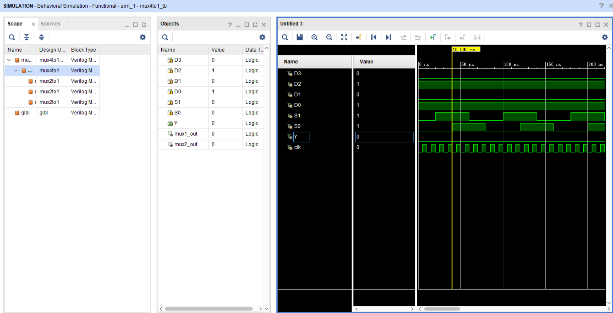

现象描述：输出端口Y无波形，输入端D0,D1,D2,D3,S0,S1波形正常，时钟波形正常。  
错误分析：在二选一数据选择器的数据流描述中有错误代码段：
`assign Y = A & (~S) + B & S;`
应修改为：
`assign Y = (A & (~S)) + (B & S);`
或
`assign Y = A & (~S) | B & S;`

2.3.2修改代码后波形图
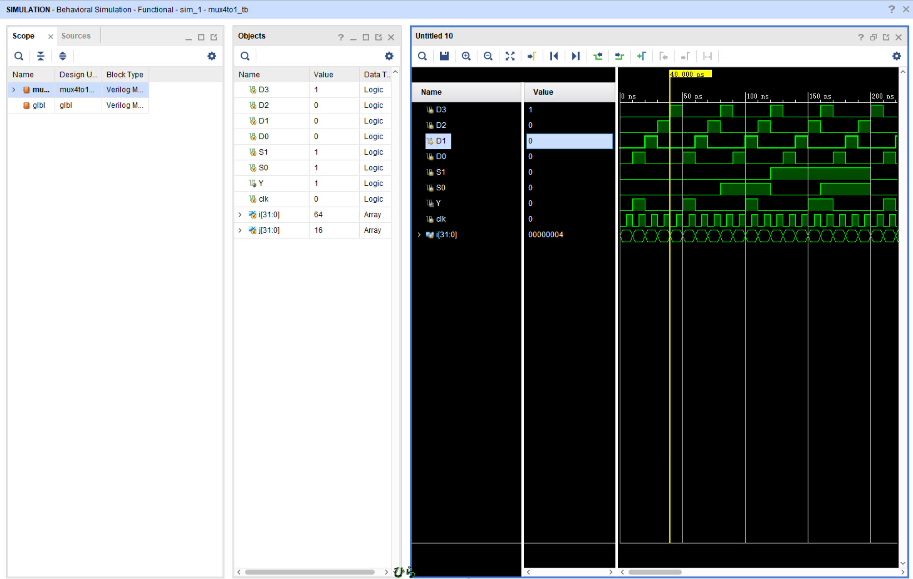

现象描述：波形图符合预期，四选一选择器工作正常

#### 2.4 开发板测试

开发板工作状态照片
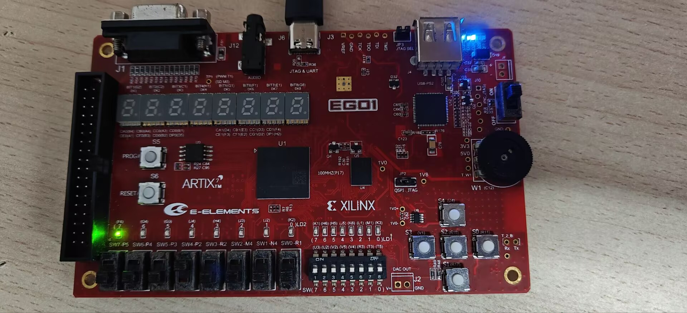
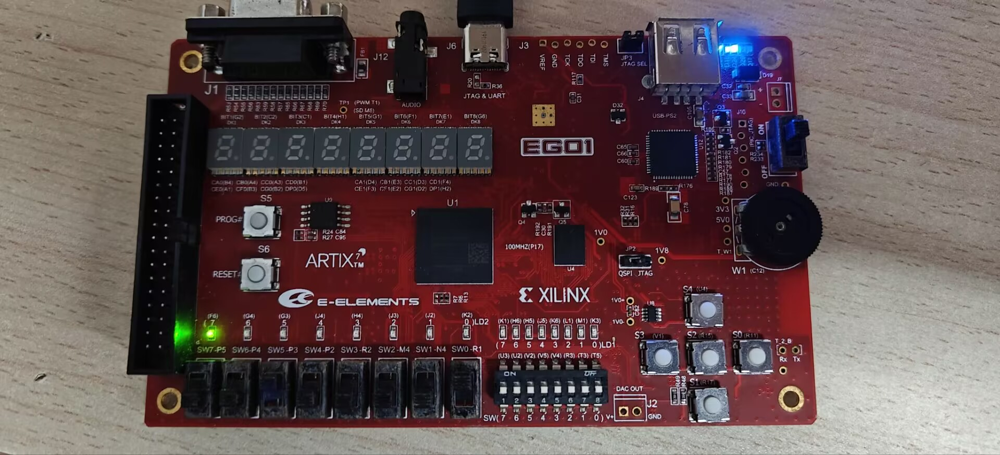

现象描述：控制信号为‘00’时，D0（P2开关）的状态决定输出信号的状态；控制信号为‘01’时，D1（P3开关）的状态决定输出信号的状态

### 三. 实验代码

#### 3.1 二选一数据选择器描述

3.1.1 数据流描述

```verilog
module mux2to1(A, B, S, Y);
    input A, B, S;
    output Y;
    // 数据流描述
    assign Y = A & (~S) + B & S;
endmodule
```

3.1.2 门级描述

```verilog
module mux2to1(A, B, S, Y);
    input A, B, S;
    output Y;
    // 门级描述
    wire Y1, Y2, notS;
    and a1(Y1, A, notS);
    and a2(Y2, B, S);
    not (notS, S);
    or (Y, Y1, Y2);
endmodule
```

3.1.3 行为描述（always）

```verilog
module mux2to1(A, B, S, Y);
    input A, B, S;
    output Y;
    // 行为描述
    reg Y;
    always @(*)
        begin
            if (S==0) Y = A;
            else Y = B; 
        end
endmodule
```

3.1.4 行为描述（case）

```verilog
module mux2to1(A, B, S, Y);
    input A, B, S;
    output Y;
    // 行为描述
    reg Y;
    always @(*)
        begin
            case (S)
            1'b0: Y=A;
            1'b1: Y=B;
            endcase
        end
endmodule
```

#### 3.2 四选一数据选择器代码

```verilog
module mux2to1(A, B, S, Y);
    // 输入输出定义
    input A, B, S;
    output Y;
    // 数据流描述
    assign Y = A & (~S) | B & S;
endmodule

module mux4to1(D0, D1, D2, D3, S0, S1, Y);
    // 输入输出定义
    input D3, D2, D1, D0;
    input S1, S0;
    output Y;

    // 中间变量
    wire mux1_out, mux2_out;

    // 3个二选一数据选择器
    mux2to1 mux1 (.A(D0), .B(D1), .S(S0), .Y(mux1_out));
    mux2to1 mux2 (.A(D2), .B(D3), .S(S0), .Y(mux2_out));
    mux2to1 mux3 (.A(mux1_out), .B(mux2_out), .S(S1), .Y(Y));
endmodule
```

#### 3.3 testbench代码

```verilog
`timescale 1ns / 1ps


module mux4to1_tb();
    reg D3 = 1'b0;
    reg D2 = 1'b0;
    reg D1 = 1'b0;
    reg D0 = 1'b0;
    reg S1 = 1'b0;
    reg S0 = 1'b0;
    wire Y;

    mux4to1 mux(.D3(D3), .D2(D2), .D1(D1), .D0(D0), .S1(S1), .S0(S0), .Y(Y));
    
    // 时钟信号
    reg clk = 0;
    initial begin
        forever #5 clk = ~clk;    
    end
    
    integer i, j;
    initial
    begin
        // 输入端波形变化
        for (i = 0; i < 64; i = i + 1) begin
            #10;
            D3 = (i % 4 == 3);
            D2 = (i % 4 == 2);
            D1 = (i % 4 == 1);
            D0 = (i % 4 == 0);
        end
        // 控制信号波形变化
        for (j = 0; j < 16; j = j + 1) begin
            #40;
            {S1, S0} = j % 4;
        end
    end
endmodule
```

### 四. 实验心得

通过这次实验，我学习了vivado软件的使用方法，学会了使用verilog语言编写简单的四选一数据选择器，并尝试了仿真与Debug。  

## Lab2

### 一. 实验内容

#### 1.1 设计4bit二选一数据选择器，设计4bit三选一数据选择器，4bit加法器，4bit减法器，4bit乘法器

#### 1.2 基于各个子模块，设计ALU的顶层模块

#### 1.3 尝试解决ALU的溢出问题

#### 1.4 尝试设计新功能（除法，AND，OR，NOT，XOR，比较等）

### 二. 实验步骤

#### 2.1 电路图设计

2.1.1 4bit二选一数据选择器电路图
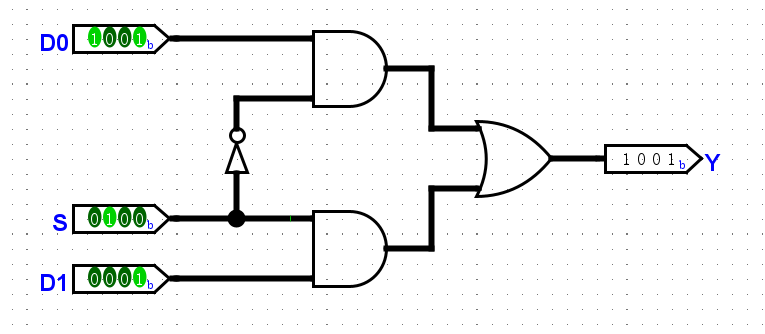

2.1.2 4bit三选一数据选择器电路图
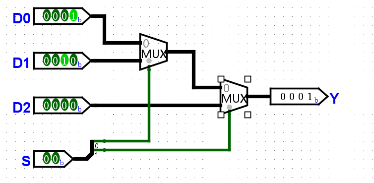

2.1.3 4bit全加器电路图
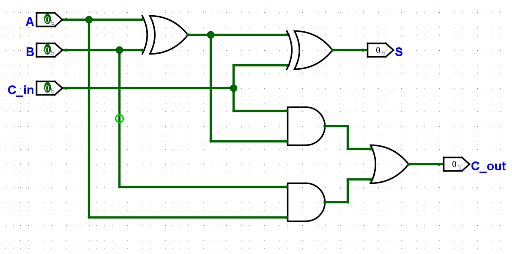

2.1.4 ALU电路图
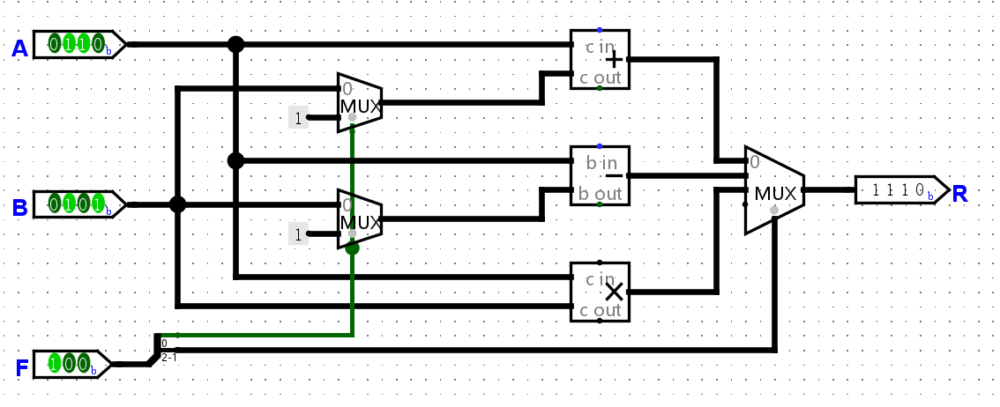

#### 2.2 代码设计

2.2.1 4bit二选一数据选择器代码

```verilog
module mux2to1(
    input [3:0] D0,
    input [3:0] D1,
    input S,
    output [3:0] Y
    );
    assign Y = S ? D1 : D0;
endmodule
```

2.2.2 4bit三选一数据选择器代码

```verilog
module mux3to1 (
    input [3:0] D0,
    input [3:0] D1,
    input [3:0] D2,
    input [1:0] S,
    output [3:0] Y
    );
    wire [3:0] mux_out;
    mux2to1 mux1(.D0(D0), .D1(D1), .S(S[0]), .Y(mux_out));
    mux2to1 mux2(.D0(mux_out), .D1(D2), .S(S[1]), .Y(Y));
endmodule
```

2.2.3 4bit加法器代码

```verilog
module full_adder(
    input A, B, Cin,
    output S, Cout
    );
    assign {Cout, S} = A + B + Cin;
endmodule

module add(
    input [3:0] add1,
    input [3:0] add2,
    output [3:0] Add
    );
    wire [3:0] sum;
    wire [3:0] carry;
    full_adder fa1(.A(add1[0]), .B(add2[0]), .Cin(0), .S(sum[0]), .Cout(carry[1]));
    full_adder fa2(.A(add1[1]), .B(add2[1]), .Cin(carry[1]), .S(sum[1]), .Cout(carry[2]));
    full_adder fa3(.A(add1[2]), .B(add2[2]), .Cin(carry[2]), .S(sum[2]), .Cout(carry[3]));
    full_adder fa4(.A(add1[3]), .B(add2[3]), .Cin(carry[3]), .S(sum[3]), .Cout());
    assign Add = sum;
endmodule
```

2.2.4 4bit减法器代码

```verilog
module sub(
    input [3:0] sub1,
    input [3:0] sub2,
    output [3:0] Sub
    );
    wire [3:0] diff;
    wire [3:0] borrow;
    full_adder fa1(.A(sub1[0]), .B(~sub2[0]), .Cin(1), .S(diff[0]), .Cout(borrow[1]));
    full_adder fa2(.A(sub1[1]), .B(~sub2[1]), .Cin(borrow[1]), .S(diff[1]), .Cout(borrow[2]));
    full_adder fa3(.A(sub1[2]), .B(~sub2[2]), .Cin(borrow[2]), .S(diff[2]), .Cout(borrow[3]));
    full_adder fa4(.A(sub1[3]), .B(~sub2[3]), .Cin(borrow[3]), .S(diff[3]), .Cout());
    assign Sub = diff;
endmodule
```

2.2.5 4bit乘法器代码

```verilog
module mul(
    input [3:0] mul1,
    input [3:0] mul2,
    output [3:0] Mul
    );
    assign Mul = mul1 * mul2;
endmodule
```

2.2.6 ALU代码

```verilog
module ALU(
    input [3:0] A,
    input [3:0] B,
    input [2:0] F,
    output [3:0] R
    );
    wire [3:0] mux1_out, mux2_out;
    mux2to1 mux1(.D0(B), .D1(4'b0001), .S(F[0]), .Y(mux1_out));
    mux2to1 mux2(.D0(B), .D1(4'b0001), .S(F[0]), .Y(mux2_out));

    wire [3:0] add_result;
    add add_inst(.add1(A), .add2(mux1_out), .Add(add_result));

    wire [3:0] sub_result;
    sub sub_inst(.sub1(A), .sub2(mux2_out), .Sub(sub_result));

    wire [3:0] mul_result;
    mul mul_inst(.mul1(A), .mul2(B), .Mul(mul_result));

    mux3to1 mux3(.D0(add_result), .D1(sub_result), .D2(mul_result), .S(F[2:1]), .Y(R));
endmodule
```

#### 2.3 仿真测试 & Debug

仿真波形图
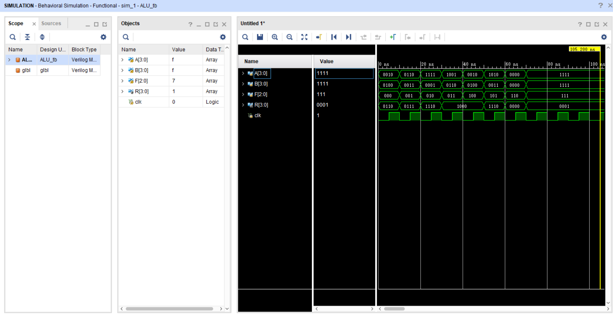

现象描述：仿真波形符合预期，选择器工作正常，各模块工作符合预期。

#### 2.4 开发板测试

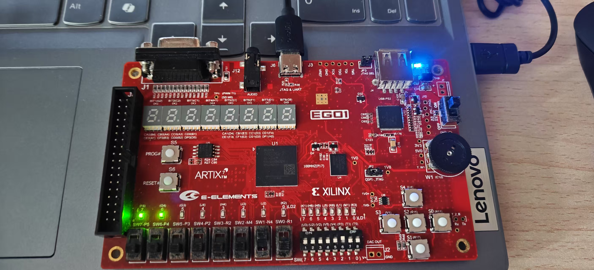
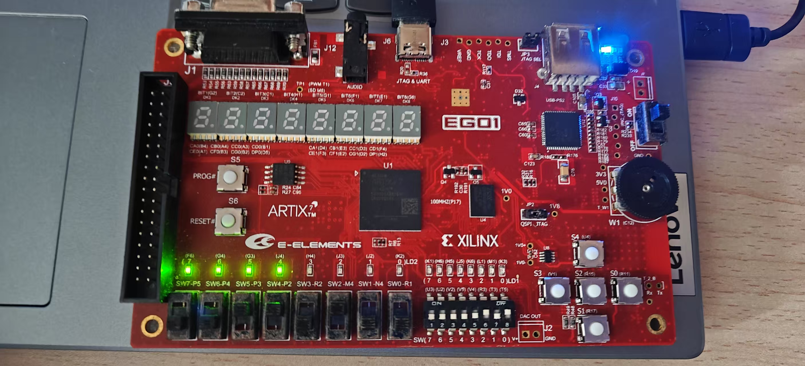

现象描述：开发板工作符合预期真值表：    
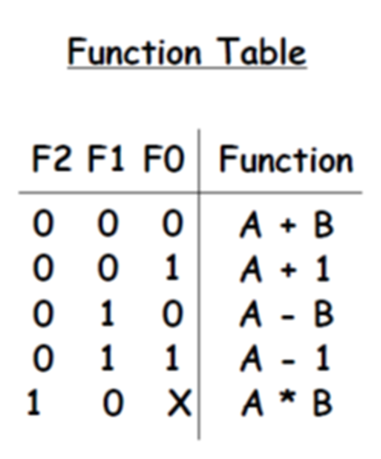

### 三. 实验代码

#### 3.1 ALU代码

```verilog
`timescale 1ns / 1ps


module mux2to1(
    input [3:0] D0,
    input [3:0] D1,
    input S,
    output [3:0] Y
    );
    assign Y = S ? D1 : D0;
endmodule

module mux3to1 (
    input [3:0] D0,
    input [3:0] D1,
    input [3:0] D2,
    input [1:0] S,
    output [3:0] Y
    );
    wire [3:0] mux_out;
    mux2to1 mux1(.D0(D0), .D1(D1), .S(S[0]), .Y(mux_out));
    mux2to1 mux2(.D0(mux_out), .D1(D2), .S(S[1]), .Y(Y));
endmodule

module full_adder(
    input A, B, Cin,
    output S, Cout
    );
    assign {Cout, S} = A + B + Cin;
endmodule

module add(
    input [3:0] add1,
    input [3:0] add2,
    output [3:0] Add
    );
    wire [3:0] sum;
    wire [3:0] carry;
    full_adder fa1(.A(add1[0]), .B(add2[0]), .Cin(0), .S(sum[0]), .Cout(carry[1]));
    full_adder fa2(.A(add1[1]), .B(add2[1]), .Cin(carry[1]), .S(sum[1]), .Cout(carry[2]));
    full_adder fa3(.A(add1[2]), .B(add2[2]), .Cin(carry[2]), .S(sum[2]), .Cout(carry[3]));
    full_adder fa4(.A(add1[3]), .B(add2[3]), .Cin(carry[3]), .S(sum[3]), .Cout());
    assign Add = sum;
endmodule

module sub(
    input [3:0] sub1,
    input [3:0] sub2,
    output [3:0] Sub
    );
    wire [3:0] diff;
    wire [3:0] borrow;
    full_adder fa1(.A(sub1[0]), .B(~sub2[0]), .Cin(1), .S(diff[0]), .Cout(borrow[1]));
    full_adder fa2(.A(sub1[1]), .B(~sub2[1]), .Cin(borrow[1]), .S(diff[1]), .Cout(borrow[2]));
    full_adder fa3(.A(sub1[2]), .B(~sub2[2]), .Cin(borrow[2]), .S(diff[2]), .Cout(borrow[3]));
    full_adder fa4(.A(sub1[3]), .B(~sub2[3]), .Cin(borrow[3]), .S(diff[3]), .Cout());
    assign Sub = diff;
endmodule

module mul(
    input [3:0] mul1,
    input [3:0] mul2,
    output [3:0] Mul
    );
    assign Mul = mul1 * mul2;
endmodule 

module ALU(
    input [3:0] A,
    input [3:0] B,
    input [2:0] F,
    output [3:0] R
    );
    wire [3:0] mux1_out, mux2_out;
    mux2to1 mux1(.D0(B), .D1(4'b0001), .S(F[0]), .Y(mux1_out));
    mux2to1 mux2(.D0(B), .D1(4'b0001), .S(F[0]), .Y(mux2_out));

    wire [3:0] add_result;
    add add_inst(.add1(A), .add2(mux1_out), .Add(add_result));

    wire [3:0] sub_result;
    sub sub_inst(.sub1(A), .sub2(mux2_out), .Sub(sub_result));

    wire [3:0] mul_result;
    mul mul_inst(.mul1(A), .mul2(B), .Mul(mul_result));

    mux3to1 mux3(.D0(add_result), .D1(sub_result), .D2(mul_result), .S(F[2:1]), .Y(R));
endmodule
```

#### 3.2 testbench代码

```verilog
`timescale 1ns / 1ps


module ALU_tb();
    reg [3:0] A, B;
    reg [2:0] F;
    wire [3:0] R;

    ALU ml(.A(A), .B(B), .F(F), .R(R));

    reg clk = 0;
    initial
    begin
        forever #5 clk = ~clk;    
    end

    initial
    begin
        A = 4'b0010;
        B = 4'b0100;
        F = 3'b000;

        #10
        A = 4'b0110;
        B = 4'b0011;
        F = 3'b001;
        
        #10
        A = 4'b1111;
        B = 4'b0001;
        F = 3'b010;

        #10
        A = 4'b1001;
        B = 4'b0110;
        F = 3'b011;

        #10
        A = 4'b0010;
        B = 4'b0100;
        F = 3'b100;
        
        #10
        A = 4'b1010;
        B = 4'b0011;
        F = 3'b101;

        #10
        A = 4'b0000;
        B = 4'b0000;
        F = 3'b110;
        
        #10
        A = 4'b1111;
        B = 4'b1111;
        F = 3'b111;
    end
endmodule
```

### 四. 实验心得

通过这次实验，我学习了全加器的原理，学习了层次化设计的思路，提升了识别电路图的能力。同时我也认识到，在设计数字系统时，必须联系实际电路结构，协调各个通路，避免出现两端数据位数不相等这种问题

### 五. 补充

#### 5.1 其他函数功能

```verilog

// 全加器实现或门
module ALU_OR(
    input [3:0] A,
    input [3:0] B,
    output [3:0] R
    );
    full_adder fa1(.A(A[0]), .B(1), .Cin(B[0]), .S(), .Cout(R[0]));
    full_adder fa2(.A(A[1]), .B(1), .Cin(B[1]), .S(), .Cout(R[1]));
    full_adder fa3(.A(A[2]), .B(1), .Cin(B[2]), .S(), .Cout(R[2]));
    full_adder fa4(.A(A[3]), .B(1), .Cin(B[3]), .S(), .Cout(R[3]));
endmodule

// 全加器实现与门
module ALU_AND(
    input [3:0] A,
    input [3:0] B,
    output [3:0] R
    );
    full_adder fa1(.A(A[0]), .B(B[0]), .Cin(0), .S(), .Cout(R[0]));
    full_adder fa2(.A(A[1]), .B(B[1]), .Cin(0), .S(), .Cout(R[1]));
    full_adder fa3(.A(A[2]), .B(B[2]), .Cin(0), .S(), .Cout(R[2]));
    full_adder fa4(.A(A[3]), .B(B[3]), .Cin(0), .S(), .Cout(R[3]));
endmodule

// 全加器实现异或门
module ALU_XOR(
    input [3:0] A,
    input [3:0] B,
    output [3:0] R
    );
    full_adder fa1(.A(A[0]), .B(B[0]), .Cin(0), .S(R[0]), .Cout());
    full_adder fa2(.A(A[1]), .B(B[1]), .Cin(0), .S(R[1]), .Cout());
    full_adder fa3(.A(A[2]), .B(B[2]), .Cin(0), .S(R[2]), .Cout());
    full_adder fa4(.A(A[3]), .B(B[3]), .Cin(0), .S(R[3]), .Cout());
endmodule
```

#### 5.2 溢出解决方案：增加溢出指示灯（负数指示灯）

5.2.1 修改后的加法器代码

```verilog
module full_adder(
    input A, B, Cin,
    output S, Cout
    );
    assign {Cout, S} = A + B + Cin;
endmodule

module add(
    input [3:0] add1,
    input [3:0] add2,
    output [3:0] Add,
    output flag // flag为1时，溢出指示灯亮起
    );
    wire [3:0] sum;
    wire [3:0] carry;
    full_adder fa1(.A(add1[0]), .B(add2[0]), .Cin(0), .S(sum[0]), .Cout(carry[1]));
    full_adder fa2(.A(add1[1]), .B(add2[1]), .Cin(carry[1]), .S(sum[1]), .Cout(carry[2]));
    full_adder fa3(.A(add1[2]), .B(add2[2]), .Cin(carry[2]), .S(sum[2]), .Cout(carry[3]));
    full_adder fa4(.A(add1[3]), .B(add2[3]), .Cin(carry[3]), .S(sum[3]), .Cout(flag));  // 末位进位输入flag变量中
    assign Add = sum;
endmodule
```

5.2.2 修改后的减法器代码

```verilog
module sub(
    input [3:0] sub1,
    input [3:0] sub2,
    output [3:0] Sub,
    output flag // flag为1时，负数指示灯亮起
    );
    wire [3:0] diff;
    wire [3:0] borrow;
    full_adder fa1(.A(sub1[0]), .B(~sub2[0]), .Cin(1), .S(diff[0]), .Cout(borrow[1]));
    full_adder fa2(.A(sub1[1]), .B(~sub2[1]), .Cin(borrow[1]), .S(diff[1]), .Cout(borrow[2]));
    full_adder fa3(.A(sub1[2]), .B(~sub2[2]), .Cin(borrow[2]), .S(diff[2]), .Cout(borrow[3]));
    full_adder fa4(.A(sub1[3]), .B(~sub2[3]), .Cin(borrow[3]), .S(diff[3]), .Cout());
    assign flag = sub1 < sub2;  // sub1小于sub2时，flag的值为1，表示当前输出为负数的补码形式
    assign Sub = diff;
endmodule
```

5.2.3 修改后的乘法器代码

```verilog
module mul(
    input [3:0] mul1,
    input [3:0] mul2,
    output [3:0] Mul,
    output flag // flag为1时，溢出指示灯亮起
    );
    assign Mul = mul1 * mul2;
    assign flag = Mul[4] | Mul[5] | Mul[6] | Mul[7];    // 发生溢出时，flag的值为1
endmodule
```
