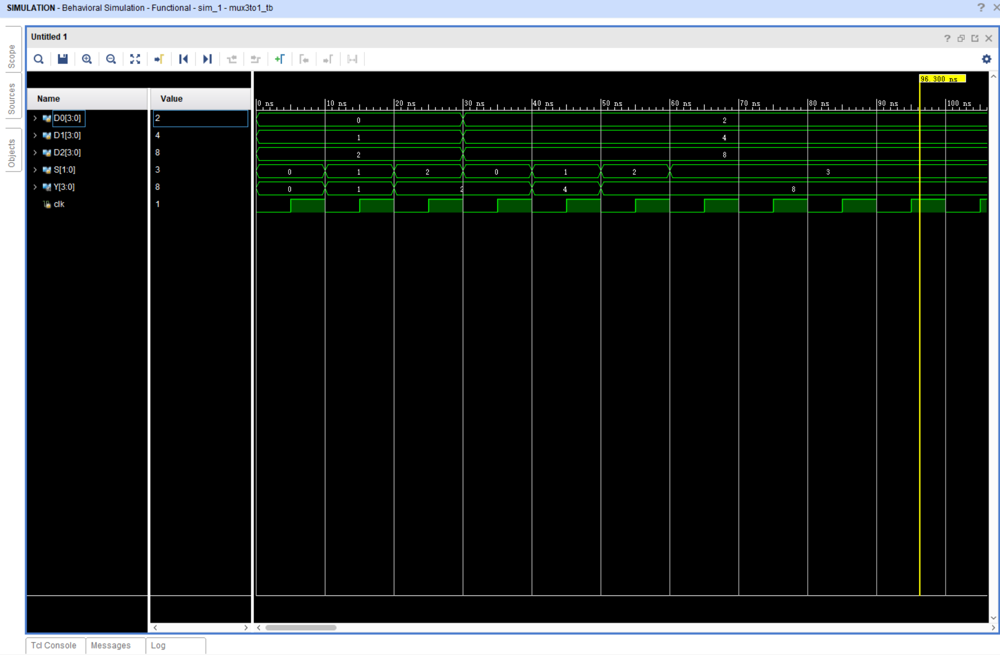
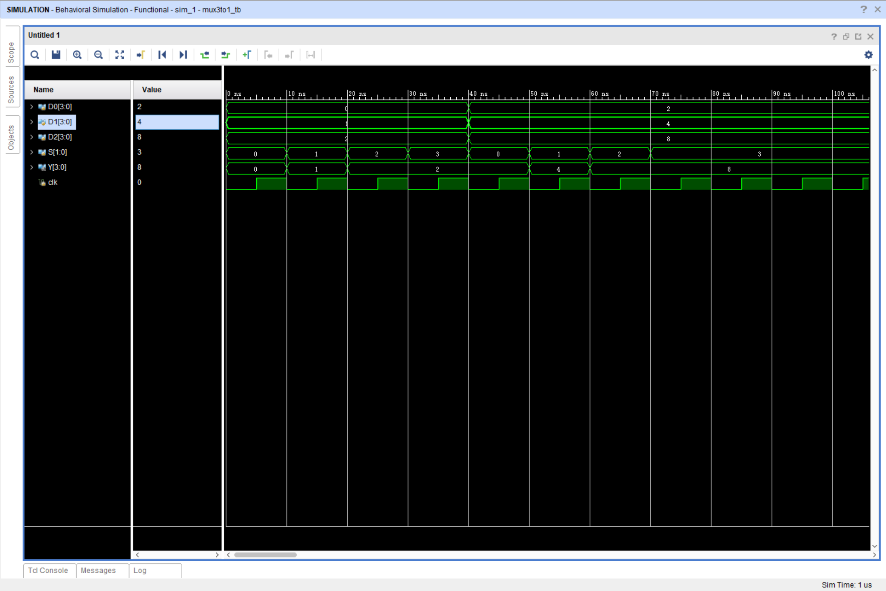
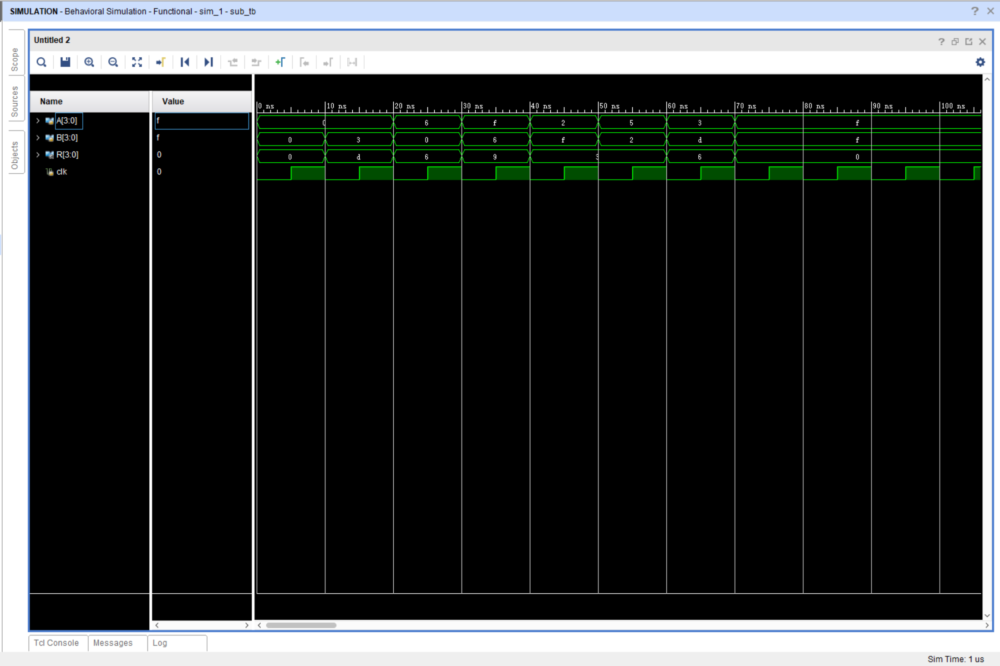
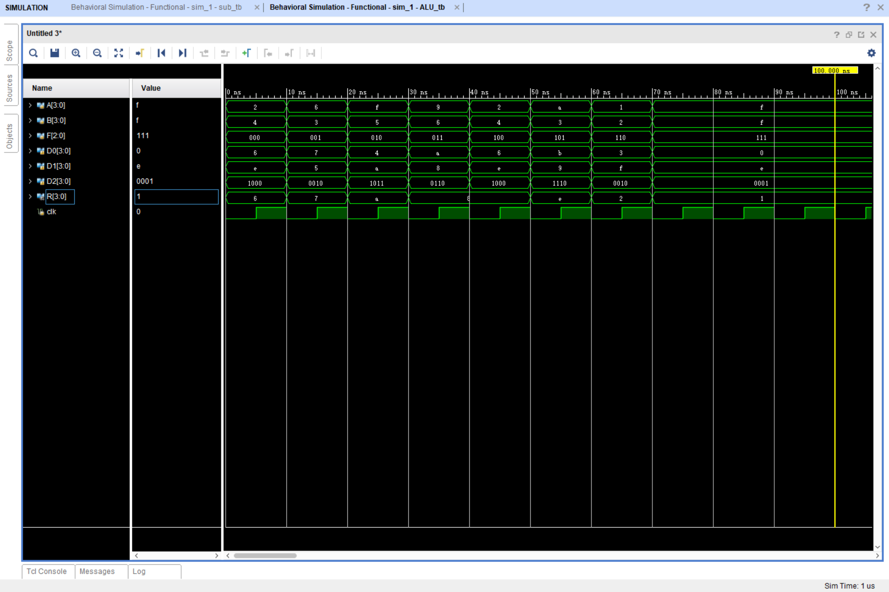

# Lab 3 实验报告

## 实验目标

学习进行 Verilog 仿真测试，测试 ALU 模块的功能

### 一. 实验内容

#### 1.1 仿真测试三选一选择器的功能

#### 1.2 仿真测试减法模块的功能

#### 1.3 仿真测试ALU的全部功能

### 二. 实验步骤

#### 2.1 测试样例设计

2.1.1 三选一选择器样例设计

```verilog
initial begin
    // 第一组样例
    D0 = 4'b0000;
    D1 = 4'b0001;
    D2 = 4'b0010;
    
    // 遍历选择器的输入端
    S = 2'b00;
    #10 S = 2'b01;
    #10 S = 2'b10;
    #10 S = 2'b11;

    // 第二组样例
    D0 = 4'b0010;
    D1 = 4'b0100;
    D2 = 4'b1000;

    // 遍历选择器的输入端
    S = 2'b00;
    #10 S = 2'b01;
    #10 S = 2'b10;
    #10 S = 2'b11;
end
```

2.1.2 减法器样例设计

```verilog
initial begin
    // 1. A, B为零
    A = 4'b0000;
    B = 4'b0000;

    // 2. A为零
    #10
    A = 4'b0000;
    B = 4'b0011;
    
    // 3. B为零
    #10
    A = 4'b0110;
    B = 4'b0000;

    // 4. A最大
    #10
    A = 4'b1111;
    B = 4'b0110;

    // 5. B最大
    #10
    A = 4'b0010;
    B = 4'b1111;

    // 6. 大减小
    #10
    A = 4'b0101;
    B = 4'b0010;

    // 7. 小减大
    #10
    A = 4'b0011;
    B = 4'b1101;

    // 8. A, B最大
    #10
    A = 4'b1111;
    B = 4'b1111;
end
```

2.1.3 ALU样例设计

```verilog
initial begin
    A = 4'b0010;
    B = 4'b0100;
    F = 3'b000; // A + B

    #10
    A = 4'b0110;
    B = 4'b0011;
    F = 3'b001; // A + 1
    
    #10
    A = 4'b1111;
    B = 4'b0101;
    F = 3'b010; // A - B

    #10
    A = 4'b1001;
    B = 4'b0110;
    F = 3'b011; // A - 1

    #10
    A = 4'b0010;
    B = 4'b0100;
    F = 3'b100; // A * B
    
    #10
    A = 4'b1010;
    B = 4'b0011;
    F = 3'b101; // A * B

    #10
    A = 4'b0000;
    B = 4'b0000;
    F = 3'b110; // 无功能
    
    #10
    A = 4'b1111;
    B = 4'b1111;
    F = 3'b111; // 无功能
end
```

#### 2.2 testbench 模块设计

2.2.1 三选一选择器 testbench

```verilog
module mux3to1_tb();
    reg [3:0] D0, D1, D2;
    reg [1:0] S;
    wire [3:0] Y;

    mux3to1 mux3to1_inst(.D0(D0), .D1(D1), .D2(D2), .S(S), .Y(Y));

    reg clk = 0;
    initial
    begin
        forever #5 clk = ~clk;
    end
    
    initial begin
        // 测试样例
    end
endmodule
```

2.2.2 减法器 testbench

```verilog
module sub_tb();
    reg [3:0] A, B;
    wire [3:0] R;

    sub sub_inst(.sub1(A), .sub2(B), .Sub(R));

    reg clk = 0;
    initial
    begin
        forever #5 clk = ~clk;    
    end

    initial begin
        // 测试样例
    end
endmodule
```

2.2.3 ALU testbench

```verilog
module ALU_tb();
    reg [3:0] A, B;
    reg [2:0] F;
    wire [3:0] R;

    ALU ml(.A(A), .B(B), .F(F), .R(R));

    reg clk = 0;
    initial
    begin
        forever #5 clk = ~clk;    
    end

    initial begin
        // 测试样例
    end
endmodule
```

#### 2.3 仿真测试

2.3.1 三选一选择器测试

选择器仿真波形图


发现问题：30ns 处`S=11`波形缺失  
解决问题：两组测试样例间增加代码行`#10`  
修改后的代码：

```verilog
initial begin
    // 第一组样例
    D0 = 4'b0000;
    D1 = 4'b0001;
    D2 = 4'b0010;
    
    // 遍历选择器输入端
    S = 2'b00;
    #10 S = 2'b01;
    #10 S = 2'b10;
    #10 S = 2'b11;

    #10 // <-此处作修改
    // 第二组样例
    D0 = 4'b0010;
    D1 = 4'b0100;
    D2 = 4'b1000;

    // 遍历选择器输入端
    S = 2'b00;
    #10 S = 2'b01;
    #10 S = 2'b10;
    #10 S = 2'b11;
end
```

再次测试得到波形图：


现象描述：

|[1:0] S|Y|
|:-:|:-:|
|00|D0|
|01|D1|
|10|D2|
|11|D2|

2.3.2 减法器测试

减法器仿真波形图


现象描述：

|[3:0] A|[3:0] B|[3:0] R|
|:-----:|:-----:|:-----:|
|0000|0000|0000|
|0000|0011|1101|
|0110|0000|0110|
|1111|0110|1001|
|0010|1111|0011|
|0101|0010|0011|
|0011|1101|0110|
|1111|1111|0000|

2.3.3 ALU 仿真测试

ALU 仿真波形图


现象描述：

|[3:0] A|[3:0] B|[2:0] F|[3:0] D0</br>(Add)|[3:0] D1</br>(Sub)|[3:0] D2</br>(Mul)|[3:0] R|
|:-:|:-:|:-:|:-:|:-:|:-:|:-:|
|2|4|000(+)|6|14|1000|6(D0)|
|6|3|001(++)|7|5|0010|7(D0)|
|15|5|010(-)|4|10|1011|10(D1)|
|9|6|011(--)|10|8|0110|8(D1)|
|2|4|100(*)|6|14|1000|8(D2)|
|10|3|101(*)|11|9|1110|14(D2)|
|1|2|110(null)|3|15|0010|2(@)|
|15|15|111(null)|0|14|0001|1(@)|

@ 遗留问题：此处输出是如何得到的？是随机值吗？

### 三. 实验代码

#### mux3to1_tb

```verilog
`timescale 1ns / 1ps


module mux3to1_tb();
    reg [3:0] D0, D1, D2;
    reg [1:0] S;
    wire [3:0] Y;

    mux3to1 mux3to1_inst(.D0(D0), .D1(D1), .D2(D2), .S(S), .Y(Y));

    reg clk = 0;
    initial
    begin
        forever #5 clk = ~clk;
    end
    
    initial begin
        // 第一组样例
        D0 = 4'b0000;
        D1 = 4'b0001;
        D2 = 4'b0010;
        
        // 遍历选择器输入端
        S = 2'b00;
        #10 S = 2'b01;
        #10 S = 2'b10;
        #10 S = 2'b11;

        // 第二组样例
        D0 = 4'b0010;
        D1 = 4'b0100;
        D2 = 4'b1000;

        // 遍历选择器输入端
        S = 2'b00;
        #10 S = 2'b01;
        #10 S = 2'b10;
        #10 S = 2'b11;
    end
endmodule
```

#### sub_tb

```verilog
`timescale 1ns / 1ps


module sub_tb();
    reg [3:0] A, B;
    wire [3:0] R;

    sub sub_inst(.sub1(A), .sub2(B), .Sub(R));

    reg clk = 0;
    initial
    begin
        forever #5 clk = ~clk;    
    end

    initial begin
        // 1. A, B为零
        A = 4'b0000;
        B = 4'b0000;

        // 2. A为零
        #10
        A = 4'b0000;
        B = 4'b0011;
        
        // 3. B为零
        #10
        A = 4'b0110;
        B = 4'b0000;

        // 4. A最大
        #10
        A = 4'b1111;
        B = 4'b0110;

        // 4. B最大
        #10
        A = 4'b0010;
        B = 4'b1111;

        // 5. 大减小
        #10
        A = 4'b0101;
        B = 4'b0010;

        // 6. 小减大
        #10
        A = 4'b0011;
        B = 4'b1101;

        // 7. A, B最大
        #10
        A = 4'b1111;
        B = 4'b1111;
    end
endmodule
```

#### ALU_tb

```verilog
`timescale 1ns / 1ps


module ALU_tb();
    reg [3:0] A, B;
    reg [2:0] F;
    wire [3:0] R;

    ALU ml(.A(A), .B(B), .F(F), .R(R));

    reg clk = 0;
    initial
    begin
        forever #5 clk = ~clk;    
    end

    initial begin
        A = 4'b0010;
        B = 4'b0100;
        F = 3'b000; // A + B

        #10
        A = 4'b0110;
        B = 4'b0011;
        F = 3'b001; // A + 1
        
        #10
        A = 4'b1111;
        B = 4'b0101;
        F = 3'b010; // A - B

        #10
        A = 4'b1001;
        B = 4'b0110;
        F = 3'b011; // A - 1

        #10
        A = 4'b0010;
        B = 4'b0100;
        F = 3'b100; // A * B
        
        #10
        A = 4'b1010;
        B = 4'b0011;
        F = 3'b101; // A * B

        #10
        A = 4'b0100;
        B = 4'b0001;
        F = 3'b110; // 无功能
        
        #10
        A = 4'b1001;
        B = 4'b1011;
        F = 3'b111; // 无功能
    end
endmodule
```

### 四. 实验心得

在这次实验中，我学会了编testbench代码，学会了使用Vivado软件进行仿真模拟，学会了识别波形图，并能够通过识别波形图中的信息分析代码中的错误并进行修正。
