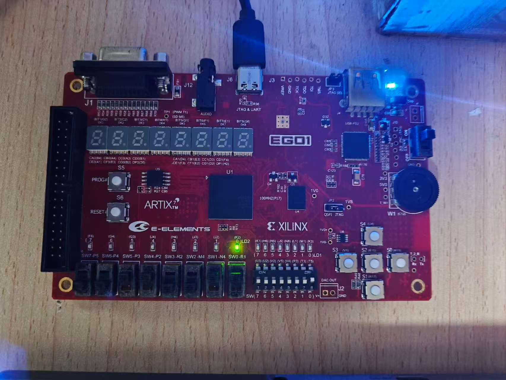
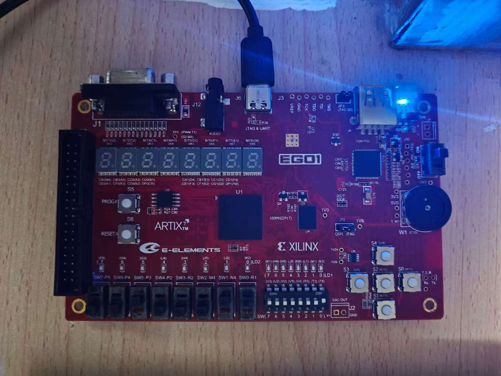

# Lab6 实验报告

## 一、实验目标

### 设计一个专用微处理器，用于计算输入的8位数据中0和1的个数是否相等

## 二、实验设计

### 2.1 逻辑设计

数据通路结构


状态图


控制字

|                         | *NMUX* | *CountMUX* | *NLoad* | *CountLoad* | *OutputMUX* | *OE* |
| ----------------------- | ------ | ---------- | ------- | ----------- | ----------- | ---- |
| *S0*  count=0  INPUT  N | *1*    | *1*        | *1*     | *1*         | *X*         | *0*  |
| *S1*  extra             | *X*    | *X*        | *0*     | *0*         | *X*         | *0*  |
| *S2*  count=  count+1   | *X*    | *0*        | *0*     | *1*         | *X*         | *0*  |
| *S3*  N=N>>1            | *0*    | *X*        | *1*     | *0*         | *X*         | *0*  |
| *S4*  out0              | *X*    | *X*        | *0*     | *0*         | *0*         | *1*  |
| *S5*  out1              | *X*    | *X*        | *0*     | *0*         | *1*         | *1*  |

### 2.2 代码设计

数据通路代码

```verilog
module DataPath(
    input [7:0] N,
    input clk, rst,
    input NMUX, CountMUX, NLoad, CountLoad, OutputMUX, OE,
    output N_equal_0, N0_equal_0, Count_equal_4,
    output out
    );

    reg [7:0] Q;
    reg [3:0] count;

    wire [7:0] D1 = NMUX ? N : Q >> 1;
    wire [3:0] D2 = CountMUX ? 0 : count + 1;

    always @(posedge clk or posedge rst) begin
        if (rst) Q <= 0;
        else if (NLoad) Q <= D1;
    end

    always @(posedge clk or posedge rst) begin
        if (rst) count <= 0;
        else if (CountLoad) count <= D2;
    end

    assign N_equal_0 = (Q == 0);
    assign N0_equal_0 = (Q[0] == 0);
    assign Count_equal_4 = (count == 4);

    assign out = OE ? OutputMUX ? 1 : 0 : 0;
endmodule
```

控制单元代码

```verilog
module control_FSM(
    clk, rst,
    N_equal_0, N0_equal_0, Count_equal_4,
    NMUX, CountMUX, NLoad, CountLoad, OutputMUX, OE
    );

    input clk, rst;
    input N_equal_0, N0_equal_0, Count_equal_4;
    output reg NMUX, CountMUX, NLoad, CountLoad, OutputMUX, OE;

    parameter S0 = 0, S1 = 1, S2 = 2, S3 = 3, S4 = 4, S5 = 5;

    reg [2:0] state, next_state;
    always @(*) begin
        case (state)
            S0: begin
                next_state = S1;
            end
            S1: begin
                if (!N_equal_0) begin
                    if (!N0_equal_0) begin
                        next_state = S2;
                    end else begin
                        next_state = S3;
                    end
                end else begin
                    if (!Count_equal_4) begin
                        next_state = S4;
                    end else begin
                        next_state = S5;
                    end
                end
            end
            S2: begin
                next_state = S3;
            end
            S3: begin
                next_state = S1;
            end
            S4: begin
                next_state = S4;
            end
            S5: begin
                next_state = S5;
            end
            default:
                next_state = S0;
        endcase
    end

    always @(posedge clk) begin
        if (rst) state = 0;
        else state = next_state;
    end

    always @(*) begin
        case (state)
            S0: begin
                NMUX = 1;
                CountMUX = 1;
                NLoad = 1;
                CountLoad = 1;
                OE = 0;
            end
            S1: begin
                NLoad = 0;
                CountLoad = 0;
                OE = 0;
            end
            S2: begin
                CountMUX = 0;
                NLoad = 0;
                CountLoad = 1;
                OE = 0;
            end
            S3: begin
                NMUX = 0;
                NLoad = 1;
                CountLoad = 0;
                OE = 0;
            end
            S4: begin
                NLoad = 0;
                CountLoad = 0;
                OutputMUX = 0;
                OE = 1;
            end
            S5: begin
                NLoad = 0;
                CountLoad = 0;
                OutputMUX = 1;
                OE = 1;
            end
            default: begin
                NMUX = 1;
                CountMUX = 1;
                NLoad = 1;
                CountLoad = 1;
                OutputMUX = 0;
                OE = 0;
            end
        endcase
    end
endmodule
```

顶层代码

```
module Dedicate_MicroProcessor(
    input clk,
    input rst,
    input [7:0] N,
    output led
    );

    wire NMUX, CountMUX, NLoad, CountLoad, OE, OutputMUX;
    wire N_equal_0, N0_equal_0, Count_equal_4;

    control_FSM CU(
        .clk           (clk           ),
        .rst           (rst           ),
        .N_equal_0     (N_equal_0     ),
        .N0_equal_0    (N0_equal_0    ),
        .Count_equal_4 (Count_equal_4 ),
        .NMUX          (NMUX          ),
        .CountMUX      (CountMUX      ),
        .NLoad         (NLoad         ),
        .CountLoad     (CountLoad     ),
        .OutputMUX     (OutputMUX     ),
        .OE            (OE            )
    );
    
    DataPath u_DataPath(
        .N             (N             ),
        .clk           (clk           ),
        .rst           (rst           ),
        .NMUX          (NMUX          ),
        .CountMUX      (CountMUX      ),
        .NLoad         (NLoad         ),
        .CountLoad     (CountLoad     ),
        .OutputMUX     (OutputMUX     ),
        .OE            (OE            ),
        .N_equal_0     (N_equal_0     ),
        .N0_equal_0    (N0_equal_0    ),
        .Count_equal_4 (Count_equal_4 ),
        .out           (led           )
    );
endmodule
```

### 2.3 仿真及上板测试

仿真结果


次态转移正常，输出逻辑正常

上板测试结果


板上现象符合预期

## 三、实验心得

本次实验主题为CPU设计，在实验过程中，我深入理解了CPU的结构，体会了代码结构化设计和顶层模块设计，充分将状态图和电路图与代码设计结合起来，这是设计复杂数字系统的第一步。
