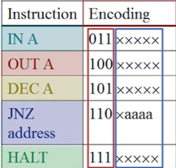
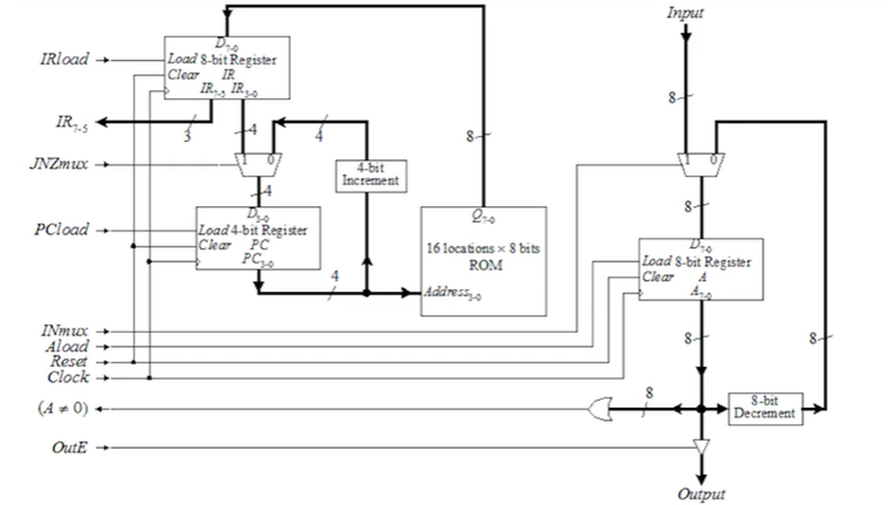
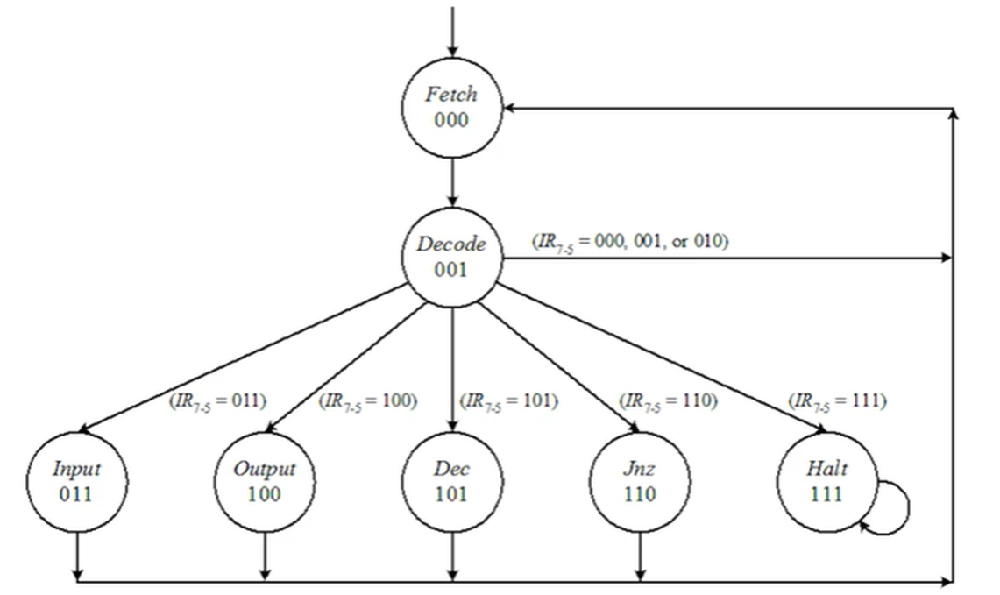
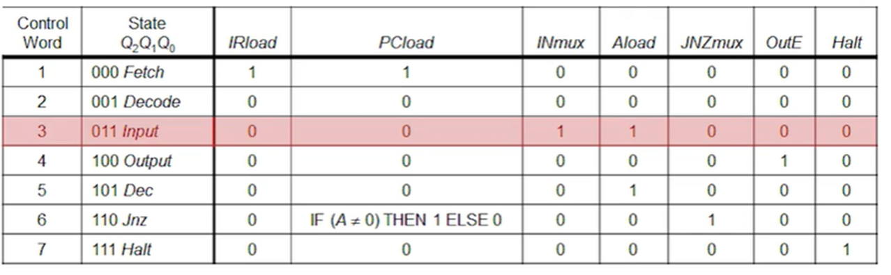
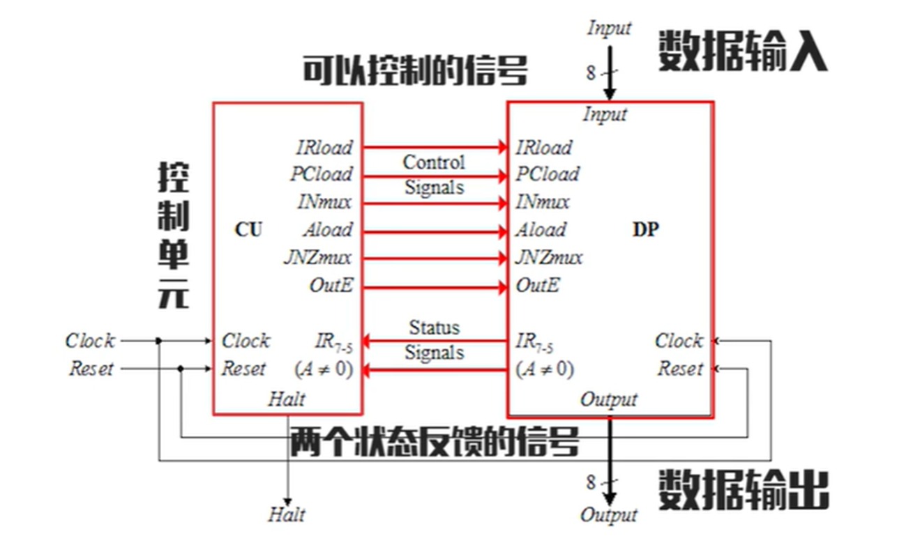
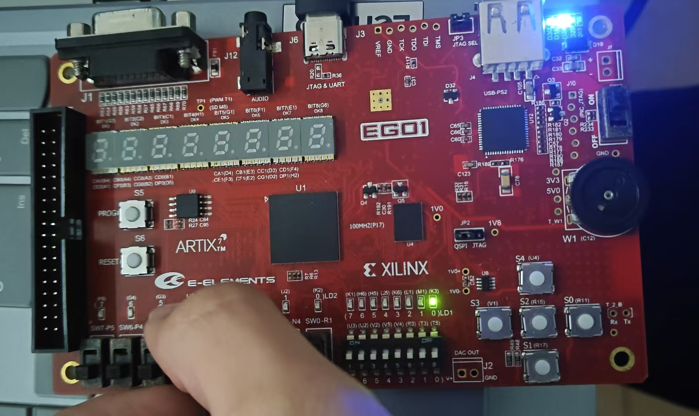

# Lab 7 实验报告

## 一、实验目标

### 完成 EC-1 通用处理器的设计，并上板验证

## 二、实验设计

### 2.1 指令集设计



### 2.2 数据通路设计



Verilog代码：

```Verilog
module datapath(
    input IRload, JNZmux, PCload, INmux, Aload, Reset, clk, OutE,
    input [7:0] INPUT,
    output [2:0] IR,
    output AnotZero,
    output [7:0] OUTPUT
);
    // 描述A累加器
    wire [7:0] DecOut, Ain, Aout;
    mux2to1 #(.N(8)) Amux(.mux(INmux), .Ina(DecOut), .Inb(INPUT), .out(Ain));
    Register #(.N(8)) Areg(.clk(clk), .load(Aload), .clear(Reset), .loaddata(Ain), .outdata(Aout));
    Decrement #(.N(8)) Adec(.DecInput(Aout), .DecOutput(DecOut));

    // 描述指令ROM
    wire [3:0] PCaddress;
    wire [7:0] instruction;
    InstructionROM ROM(.ina(PCaddress), .out(instruction));

    // 描述指令寄存器
    wire [7:0] reg_instruction;
    Register #(.N(8)) InReg(.clk(clk), .load(IRload), .clear(Reset), .loaddata(instruction), .outdata(reg_instruction));

    // 描述PC寄存器
    wire [3:0] Incout, PCin, PCout;
    mux2to1 #(.N(4)) PCmux(.mux(JNZmux), .Ina(Incout), .Inb(reg_instruction[3:0]), .out(PCin));
    Register #(.N(4)) PCreg(.clk(clk), .load(PCload), .clear(Reset), .loaddata(PCin), .outdata(PCout));
    Increment #(.N(4)) PCinc(.IncInput(PCout), .IncOutput(Incout));
    assign PCaddress = PCout;
    
    // 描述输出
    assign IR = reg_instruction[7:5];
    assign AnotZero = (Aout != 0);
    assign OUTPUT = OutE ? Aout : 8'b0;
endmodule
```

### 2.3 状态机和控制字输出设计




Verilog代码：

```Verilog
// Next-state logic
    always @(*) begin
        case (current_state)
            FETCH: next_state = DECODE;
            DECODE: begin
                case (IR)
                    IN, OUT, DEC, JNZ, HALT: next_state = IR;
                    default: next_state = FETCH;
                endcase
            end
            IN, OUT, DEC, JNZ: next_state = FETCH;
            HALT: next_state = HALT;
            default: next_state = FETCH;
        endcase
    end

    // Output logic
    always @(*) begin
        IRload = 0;
        JNZmux = 0;
        PCload = 0;
        INmux = 0;
        Aload = 0;
        OutE = 0;
        case (current_state)
            FETCH: begin 
                IRload = 1; 
                PCload = 1; 
            end
            IN: begin 
                INmux = 1; 
                Aload = 1; 
            end
            OUT: begin 
                OutE = 1; 
            end
            DEC: begin 
                Aload = 1; 
            end
            JNZ: begin 
                JNZmux = 1; 
                PCload = AnotZero ? 1 : 0; 
            end
        endcase
    end
```

### 2.4 数据通路+控制单元设计



顶层模块Verilog代码：

```Verilog
module EC1(
    input [7:0] A,
    input clk, Reset,
    output [7:0] led,
    output H
);
    wire clk_2s;
    clk_div div1(.clk(clk), .reset(Reset), .clk_2s(clk_2s));

    wire IRload, JNZmux, PCload, INmux, Aload, OutE;
    wire AnotZero;
    wire [2:0] IR;
    
    datapath u_datapath(
        .IRload   (IRload   ),
        .JNZmux   (JNZmux   ),
        .PCload   (PCload   ),
        .INmux    (INmux    ),
        .Aload    (Aload    ),
        .Reset    (Reset    ),
        .clk      (clk_2s   ),
        .OutE     (OutE     ),
        .INPUT    (A        ),
        .IR       (IR       ),
        .AnotZero (AnotZero ),
        .OUTPUT   (led      )
    );
    
    control_unit u_control_unit(
        .clk      (clk_2s   ),
        .Reset    (Reset    ),
        .AnotZero (AnotZero ),
        .IR       (IR       ),
        .IRload   (IRload   ),
        .JNZmux   (JNZmux   ),
        .PCload   (PCload   ),
        .INmux    (INmux    ),
        .Aload    (Aload    ),
        .OutE     (OutE     ),
        .H        (H        ) 
    );
endmodule
```

### 2.5 ROM 储存指令设计

Verilog代码：

```Verilog
module InstructionROM (
    input [3:0] ina,
    output reg [7:0] out
);
    reg [7:0] rom [15:0];

    initial begin
        rom[0] = 8'b01100000;
        rom[1] = 8'b10000000;
        rom[2] = 8'b10100000;
        rom[3] = 8'b11000001;
        rom[4] = 8'b11111111;
        rom[5] = 8'b00000000;
        rom[6] = 8'b00000000;
        rom[7] = 8'b00000000;
        rom[8] = 8'b00000000;
        rom[9] = 8'b00000000;
        rom[10] = 8'b00000000;
        rom[11] = 8'b00000000;
        rom[12] = 8'b00000000;
        rom[13] = 8'b00000000;
        rom[14] = 8'b00000000;
        rom[15] = 8'b00000000;
    end

    always @(*) begin
        out = rom[ina];
    end
endmodule
```

## 三、完整模块设计

### EC1

```Verilog
module EC1(
    input [7:0] A,
    input clk, Reset,
    output [7:0] led,
    output H
);
    wire clk_2s;
    clk_div div1(.clk(clk), .reset(Reset), .clk_2s(clk_2s));

    wire IRload, JNZmux, PCload, INmux, Aload, OutE;
    wire AnotZero;
    wire [2:0] IR;
    
    datapath u_datapath(
        .IRload   (IRload   ),
        .JNZmux   (JNZmux   ),
        .PCload   (PCload   ),
        .INmux    (INmux    ),
        .Aload    (Aload    ),
        .Reset    (Reset    ),
        .clk      (clk_2s   ),
        .OutE     (OutE     ),
        .INPUT    (A        ),
        .IR       (IR       ),
        .AnotZero (AnotZero ),
        .OUTPUT   (led      )
    );
    
    control_unit u_control_unit(
        .clk      (clk_2s   ),
        .Reset    (Reset    ),
        .AnotZero (AnotZero ),
        .IR       (IR       ),
        .IRload   (IRload   ),
        .JNZmux   (JNZmux   ),
        .PCload   (PCload   ),
        .INmux    (INmux    ),
        .Aload    (Aload    ),
        .OutE     (OutE     ),
        .H        (H        ) 
    );
endmodule
```

### datapath

```Verilog
module datapath(
    input IRload, JNZmux, PCload, INmux, Aload, Reset, clk, OutE,
    input [7:0] INPUT,
    output [2:0] IR,
    output AnotZero,
    output [7:0] OUTPUT
);
    // 描述A累加器
    wire [7:0] DecOut, Ain, Aout;
    mux2to1 #(.N(8)) Amux(.mux(INmux), .Ina(DecOut), .Inb(INPUT), .out(Ain));
    Register #(.N(8)) Areg(.clk(clk), .load(Aload), .clear(Reset), .loaddata(Ain), .outdata(Aout));
    Decrement #(.N(8)) Adec(.DecInput(Aout), .DecOutput(DecOut));

    // 描述指令ROM
    wire [3:0] PCaddress;
    wire [7:0] instruction;
    InstructionROM ROM(.ina(PCaddress), .out(instruction));

    // 描述指令寄存器
    wire [7:0] reg_instruction;
    Register #(.N(8)) InReg(.clk(clk), .load(IRload), .clear(Reset), .loaddata(instruction), .outdata(reg_instruction));

    // 描述PC寄存器
    wire [3:0] Incout, PCin, PCout;
    mux2to1 #(.N(4)) PCmux(.mux(JNZmux), .Ina(Incout), .Inb(reg_instruction[3:0]), .out(PCin));
    Register #(.N(4)) PCreg(.clk(clk), .load(PCload), .clear(Reset), .loaddata(PCin), .outdata(PCout));
    Increment #(.N(4)) PCinc(.IncInput(PCout), .IncOutput(Incout));
    assign PCaddress = PCout;
    
    // 描述输出
    assign IR = reg_instruction[7:5];
    assign AnotZero = (Aout != 0);
    assign OUTPUT = OutE ? Aout : 8'b0;
endmodule
```

### control_unit

```Verilog
module control_unit(
    input clk, Reset,
    input [2:0] IR,
    input AnotZero,
    output reg IRload, JNZmux, PCload, INmux, Aload, OutE,
    output H
);

    reg [2:0] current_state, next_state;
    parameter FETCH = 3'b000, DECODE = 3'b001, IN = 3'b011, OUT = 3'b100, DEC = 3'b101, JNZ = 3'b110, HALT = 3'b111;

    // Next-state logic
    always @(*) begin
        case (current_state)
            FETCH: next_state = DECODE;
            DECODE: begin
                case (IR)
                    IN, OUT, DEC, JNZ, HALT: next_state = IR;
                    default: next_state = FETCH;
                endcase
            end
            IN, OUT, DEC, JNZ: next_state = FETCH;
            HALT: next_state = HALT;
            default: next_state = FETCH;
        endcase
    end

    always @(posedge clk or posedge Reset) begin
        if (Reset)
            current_state <= FETCH;
        else
            current_state <= next_state;
    end

    // Output logic
    always @(*) begin
        IRload = 0;
        JNZmux = 0;
        PCload = 0;
        INmux = 0;
        Aload = 0;
        OutE = 0;
        case (current_state)
            FETCH: begin 
                IRload = 1; 
                PCload = 1; 
            end
            IN: begin 
                INmux = 1; 
                Aload = 1; 
            end
            OUT: begin 
                OutE = 1; 
            end
            DEC: begin 
                Aload = 1; 
            end
            JNZ: begin 
                JNZmux = 1; 
                PCload = AnotZero ? 1 : 0; 
            end
        endcase
    end

    assign H = (current_state == HALT);
endmodule
```

### clk_div

```Verilog
module clk_div(
    input clk,
    input reset,
    output reg clk_2s
);
    reg [31:0] counter;

    parameter DIV_VALUE = 25000000;

    always @(posedge clk or posedge reset) begin
        if (reset) begin
            counter <= 0;
            clk_2s <= 0;
        end else begin
            if (counter == DIV_VALUE - 1) begin
                counter <= 0;
                clk_2s <= ~clk_2s;
            end else begin
                counter <= counter + 1;
            end
        end
    end
endmodule
```

### Register

```Verilog
module Register #(parameter N = 8) (
    input clk, load, clear,
    input [N-1:0] loaddata,
    output reg [N-1:0] outdata
);
    always @(posedge clk or posedge clear) begin
        if (clear)
            outdata <= 0;
        else if (load)
            outdata <= loaddata;
    end
endmodule
```

### Decrement

```Verilog
module Decrement #(parameter N = 8) (
    input [N-1:0] DecInput,
    output [N-1:0] DecOutput
);
    assign DecOutput = DecInput - 1;
endmodule
```

### Increment

```Verilog
module Increment #(parameter N = 4) (
    input [N-1:0] IncInput,
    output [N-1:0] IncOutput
);
    assign IncOutput = IncInput + 1;
endmodule
```

### mux2to1

```Verilog
module mux2to1 #(parameter N = 8) (
    input mux,
    input [N-1:0] Ina, Inb,
    output [N-1:0] out
);
    assign out = mux ? Inb : Ina;
endmodule
```

### InstructionROM

```Verilog
module InstructionROM (
    input [3:0] ina,
    output reg [7:0] out
);
    reg [7:0] rom [15:0];

    initial begin
        rom[0] = 8'b01100000;
        rom[1] = 8'b10000000;
        rom[2] = 8'b10100000;
        rom[3] = 8'b11000001;
        rom[4] = 8'b11111111;
        rom[5] = 8'b00000000;
        rom[6] = 8'b00000000;
        rom[7] = 8'b00000000;
        rom[8] = 8'b00000000;
        rom[9] = 8'b00000000;
        rom[10] = 8'b00000000;
        rom[11] = 8'b00000000;
        rom[12] = 8'b00000000;
        rom[13] = 8'b00000000;
        rom[14] = 8'b00000000;
        rom[15] = 8'b00000000;
    end

    always @(*) begin
        out = rom[ina];
    end
endmodule
```

## 四、仿真与上板测试

### 仿真测试结果


次态逻辑与控制字输出均正常

### 上板测试结果


LED显示正常，复位正常

## 五、心得体会

在这次实验中，我学习了模块调用新的方法，学习了通用微处理器的设计，深入理解了控制单元中的状态转换和PC寄存器，IR寄存器的作用。在Debug的过程中，我认识到多模块编程中应当保持变量命名的一致性，并进行合理的变量命名，以便检查和调试代码，例如变量大小写，是否缩写简写应当在整个程序中保持一致，避免编程中因为变量名不一致使得传值出错
