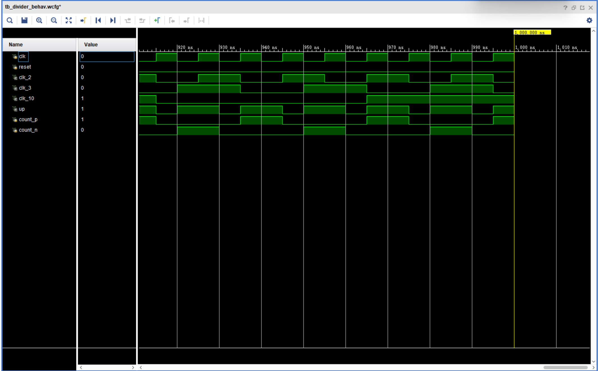

# 分频器



## 二分频

### 分析

二分频周期为 2 个时钟周期，其间系统时钟信号翻转 2 次，有 2 个上升沿，
通过计数器记系统时钟上升沿个数完成分频

### Verilog 代码

```verilog
module div2(
    input clk,
    input reset,
    output reg clk_2
    );

    // 无 posedge reset 时，仿真时若 reset 时间过短，变量无法初始化
    reg count;
    always @(posedge clk or negedge reset) begin
        if (reset) begin
            clk_2 <= 1'b0;
        end else begin
            clk_2 <= clk_2 + 1;
        end
    end
endmodule
```

## 十分频

### 分析

十分频周期为 10 个时钟信号，系统时钟翻转 10 次，有 10 个上升沿
通过计数循环 000 -> 001 -> 010 -> 011 -> 100 每 5 个上升沿进行一次翻转

### Verilog 代码

```verilog
module div10(
    input clk,
    input reset,
    output reg clk_10
    );

    reg [2:0] count;
    // 000 -> 001 -> 010 -> 011 -> 100 周期为 5
    always @(posedge clk or negedge reset) begin
        if (reset) begin
            count <= 3'b000;
            clk_10 <= 1'b0;
        end else if (count[2] == 1'b1) begin
            count[2] <= 1'b0;
            clk_10 <= ~clk_10;
        end else begin
            count <= count + 1;
        end
    end
endmodule
```

## 三分频

### 分析

奇数分频需要同时计数上升沿和下降沿，
设置合理的逻辑，生成周期为 3 的信号，驱动分频时钟信号翻转

如    n: 0⤵  0        1⤵→0⤵  
	p:     1⤴→0⤴  0        1  
 n + p:  0 1  0    0  1 0    0  1  

可见其周期为 3，符合要求

### Verilog 代码

```verilog
module div3(
    input clk,
    input reset,
    output reg clk_3
    );

    reg count_p, count_n;

    always @(posedge clk) begin
        if (reset) begin
            count_p <= 1'b0;
        end else if (count_p == 1'b1) begin
            count_p <= 1'b0;
        end else begin
            count_p <= count_n + 1;
        end
    end

    always @(negedge clk) begin
        if (reset) begin
            count_n <= 1'b0;
        end else if (count_n == 1'b1) begin
            count_n <= 1'b0;
        end else begin
            count_n <= count_p + 1;
        end
    end

    wire up;
    assign up = count_p | count_n;
    always @(posedge up or posedge reset) begin
        if (reset) begin
            clk_3 <= 1'b0;
        end else begin
            clk_3 <= ~clk_3;
        end
    end
endmodule
```

## testbench 代码

```verilog
module tb_divider;
    reg clk;
    reg reset;
    wire clk_2;
    wire clk_10;
    wire clk_3;

    div2 d2 (
        .clk(clk),
        .reset(reset),
        .clk_2(clk_2)
    );

    div10 d10 (
        .clk(clk),
        .reset(reset),
        .clk_10(clk_10)
    );

    div3 d3 (
        .clk(clk),
        .reset(reset),
        .clk_3(clk_3)
    );

    initial begin
        clk = 0;
        reset = 1;
        #20 reset = 0;

    always #5 clk = ~clk;
endmodule
```

## 上板测试顶层模块

```verilog
module top(
    input clk,
    input reset,
    input S,
    output [1:0] L
    );
    
    wire clk_ms;
    reg [25:0] count;
    always @(posedge clk or posedge reset) begin
        if (reset)
            count <= 26'h0000000;
        else
            count <= count + 1;
    end
    assign clk_ms = count[25];  // ~= 0.671ms

    wire clk_3;
    div3 d(.clk(clk_ms), .reset(reset), .clk_3(clk_3));

    assign L = S ? 2'b00 : {clk_3 ,clk_ms};
endmodule
```

