# Lab4 实验报告

## 一. 实验内容

### 1.1 设计和实现ON/OFF button

### 1.2 设计和实现基于FSM的电子锁

## 二. 实验步骤

### 2.1 按钮的实现

1. 测试下面代码的结果是否正确

    ```verilog
    module onoff(input button, output reg light);
        always @(posedge button) light <= ~light;
    endmodule
    ```

    仿真测试结果
    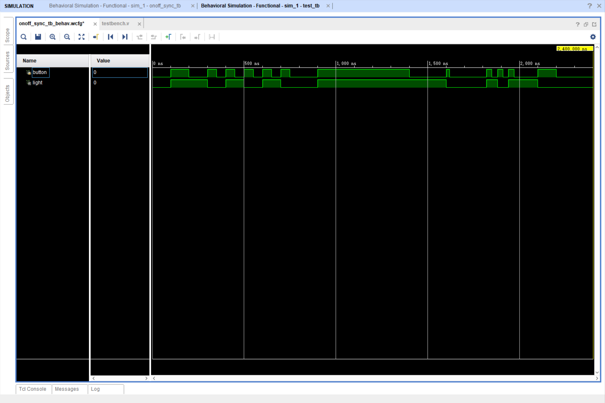

    开发板测试结果
    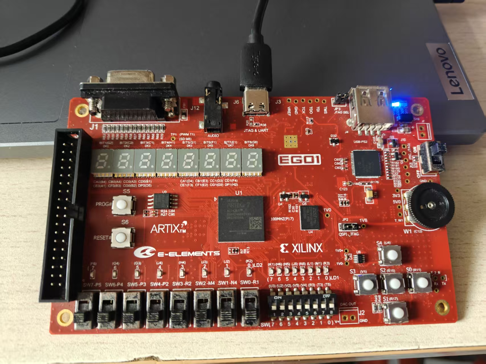

    现象描述：易受噪声干扰，无法稳定实现开关灯

2. 正确编写模块并在板中实现设计

    ```verilog
    module onoff_sync(
        input clk, reset, button_in,
        output reg light
        );
    
        // 二级触发器
        reg button, btemp;
        always @(posedge clk)
            {button, btemp} <= {btemp, button_in};
    
        // 消抖
        wire bpressed;
        debounce db1(.reset(reset), .clk(clk), .noisy(button), .clean(bpressed));
    
        // 边沿检测
        reg old_bpressed;
        always @(posedge clk) begin
            if (reset)
                begin light <= 0; old_bpressed <= 0; end
            else if (old_bpressed == 0 && bpressed == 1)
                light <= ~light;
            old_bpressed <= bpressed; 
        end
    endmodule

    module debounce(reset, clk, noisy, clean);
        input reset, clk, noisy;
        output reg clean;
    
        parameter NDELAY = 650000;
        parameter NBITS = 20;
    
        reg [NBITS-1:0] count;
        reg xnew;
    
        always @ (posedge clk)
        begin
            if (reset)
            begin
                xnew <= noisy;
                clean <= noisy;
                count <= 0;
            end
            else if (noisy != xnew)
            begin
                xnew <= noisy;
                count <= 0;
            end
            else if (count == NDELAY)
                clean <= xnew;
            else
                count <= count + 1;
        end
    endmodule
    ```

    仿真测试结果
    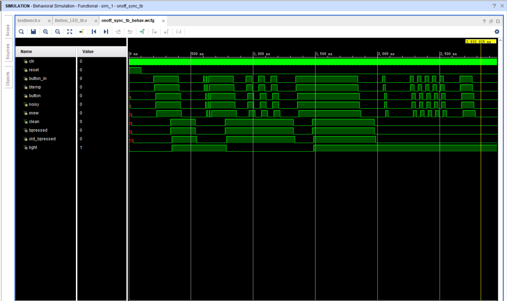

    开发板测试结果
    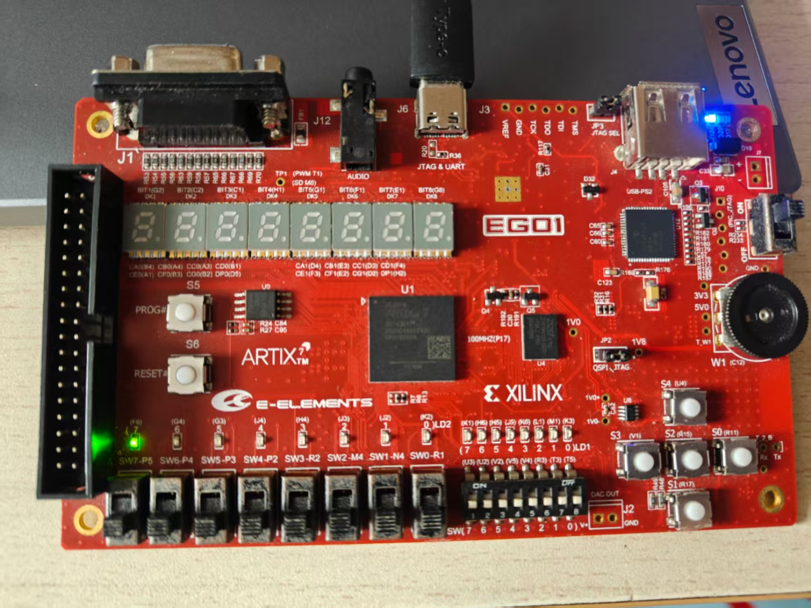

    现象描述：抗干能力提升，开关灯稳定性极大提高

3. 移除模块中的子电路，测试结果是否正确

    1) 移除二级触发器

        ```verilog
        module remove_2ff(
            input clk, reset, button_in,
            output reg light
            );

            // 消抖
            wire bpressed;
            debounce db1(.reset(reset), .clk(clk), .noisy(button_in), .clean(bpressed));

            // 边沿检测
            reg old_bpressed;
            always @(posedge clk) begin
                if (reset) begin
                    light <= 0;
                    old_bpressed <= 0;
                end else if (old_bpressed == 0 && bpressed == 1)
                    light <= ~light;
                old_bpressed <= bpressed; 
            end
        endmodule
        ```

        仿真测试结果
        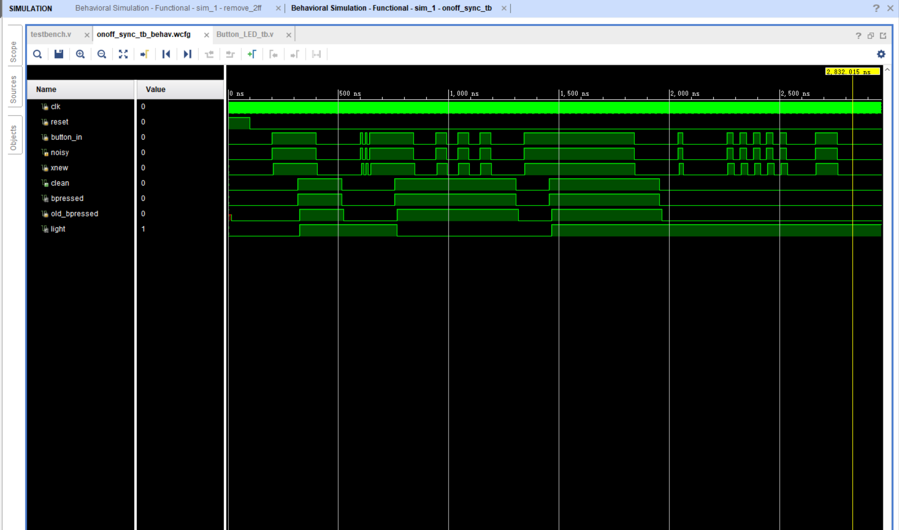

        开发板测试结果
        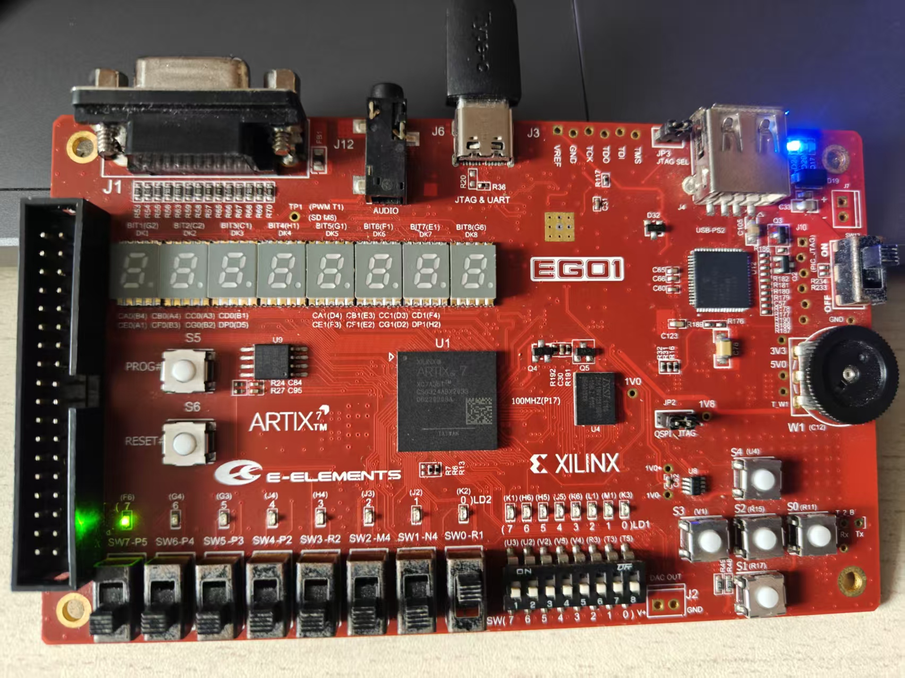

        现象描述：仿真测试结果无明显问题，实际测试中易受亚稳态影响

    2) 移除消抖模块

        ```Verilog
        module remove_debounce(
            input clk, reset, button_in,
            output reg light
            );

            // 二级触发器
            reg button, btemp;
            always @(posedge clk) begin
                {button, btemp} <= {btemp, button_in};
            end

            // 边沿检测
            reg old_bpressed;
            always @(posedge clk) begin
                if (reset) begin
                    light <= 0;
                    old_bpressed <= 0;
                end else if (old_bpressed == 0 && button_in == 1)
                    light <= ~light;
                old_bpressed <= button_in; 
            end
        endmodule
        ```

        仿真测试结果
        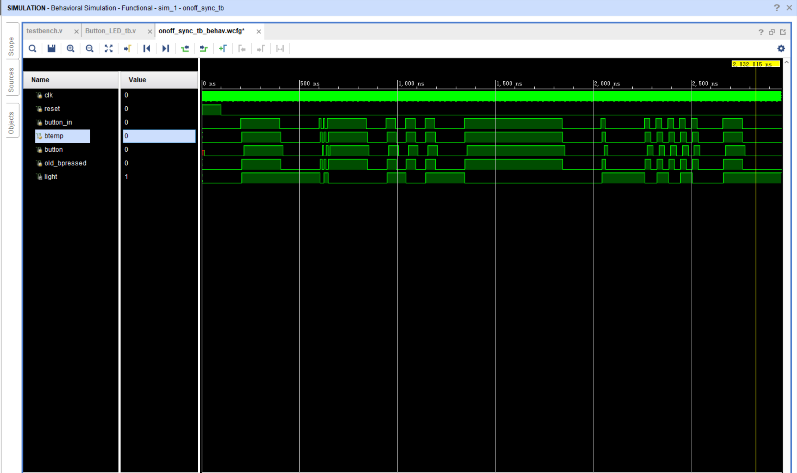

        开发板测试结果
        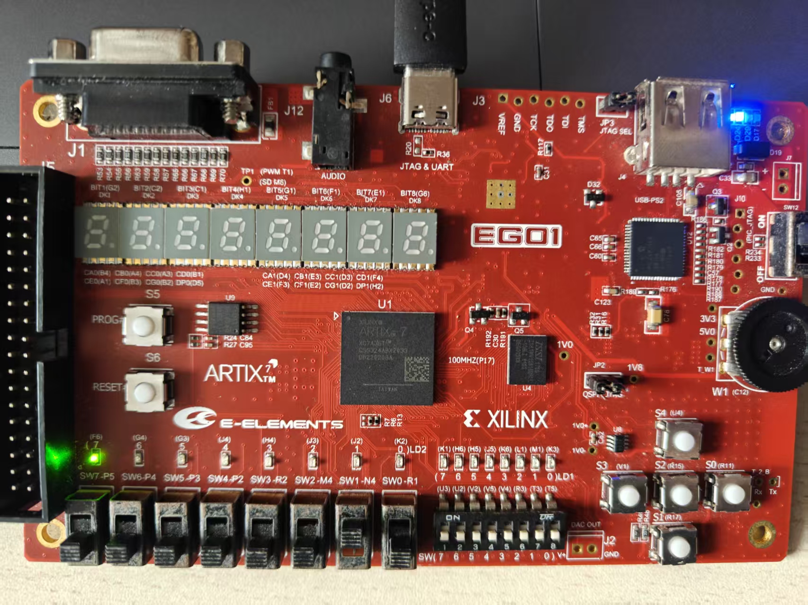

        现象描述：仿真测试中输出明显受噪声影响，实际测试中灯的亮灭易受机械振动影响

    3) 移除边沿检测

        ```verilog
        module remove_up(
            input clk, reset, button_in,
            output reg light = 0
            );
        
            // 二级触发器
            reg button, btemp;
            always @(posedge clk) begin
                {button, btemp} <= {btemp, button_in};
            end
        
            // 消抖
            wire bpressed;
            debounce db1(.reset(reset), .clk(clk), .noisy(button), .clean(bpressed));
        
            always @(posedge bpressed) begin
                light <= ~light;
            end
        endmodule
        ```

        仿真测试结果
        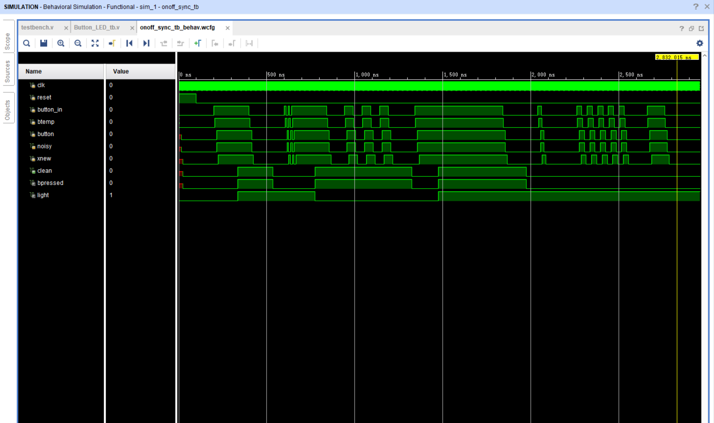

        开发板测试结果
        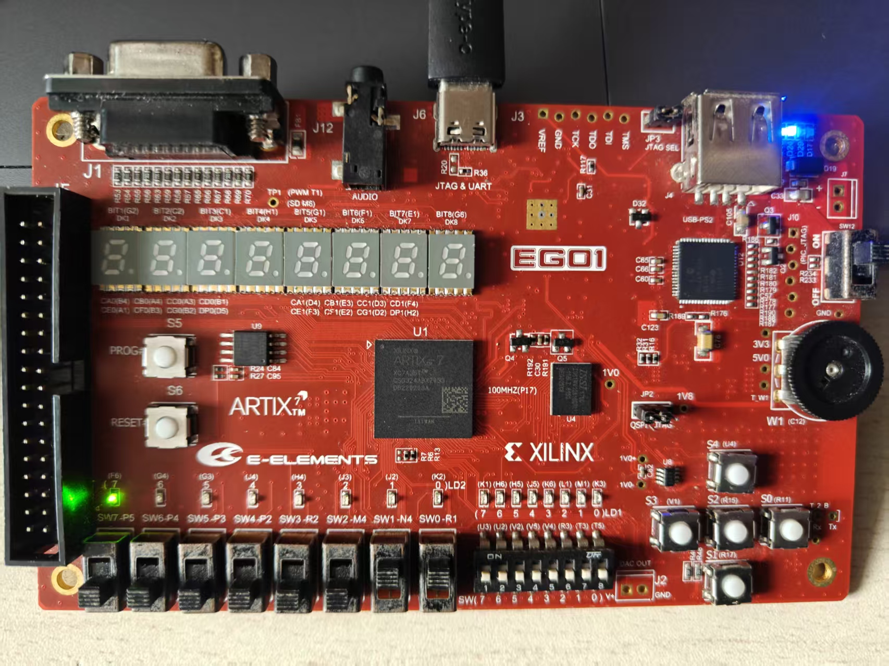

        现象描述：仿真测试中无明显问题，实际测试中灯的亮灭比较稳定。
        因为删除了reset部分代码，该电路中reset无效

        思考：下面两段代码基本等效

        ```verilog
        reg old_bpressed;
        always @(posedge clk) begin     // 同步时钟信号
            if (old_bpressed == 0 && bpressed == 1)
                light <= ~light;
            old_bpressed <= bpressed; 
        end
        ```

        ```verilog
        always @(posedge bpressed) begin    // 异步时钟信号
            light <= ~light;
        end
        ```

### 2.2 电子锁的实现

1. 绘制 FSM 的状态图
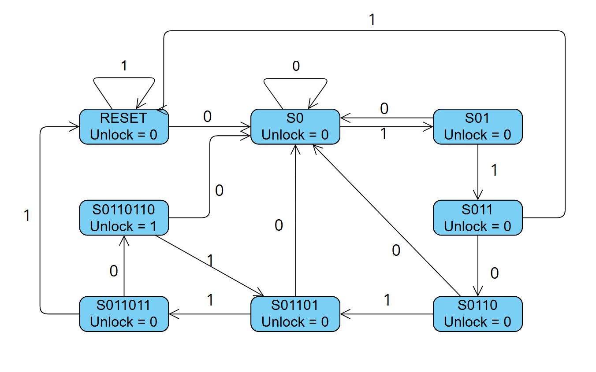

2. 编写 FSM 的行为级 Verilog 模块

    ```verilog
    module E_LOCK_FSM(
        input clk, reset,
        input b0, b1,
        output out,
        output [31:0] hex_display
        );
        // 定义状态
        parameter S_RESET = 32'h11111111;
        parameter S_0 = 32'h00000000;
        parameter S_01 = 32'h00000001;
        parameter S_011 = 32'h00000011;
        parameter S_0110 = 32'h00000110;
        parameter S_01101 = 32'h00001101;
        parameter S_011011 = 32'h00011011;
        parameter S_0110110 = 32'h00110110;

        reg [31:0] state, next_state;
        // 次态逻辑
        always @(*) begin
            if (reset)
                next_state = S_RESET;
            else
                case (state)
                    S_RESET: next_state = b0 ? S_0 : b1 ? S_RESET : state;
                    S_0: next_state = b0 ? S_0 : b1 ? S_01 : state;
                    S_01: next_state = b0 ? S_0 : b1 ? S_011 : state;
                    S_011: next_state = b0 ? S_0110 : b1 ? S_RESET : state;
                    S_0110: next_state = b0 ? S_0 : b1 ? S_01101 : state;
                    S_01101: next_state = b0 ? S_0 : b1 ? S_011011 : state;
                    S_011011: next_state = b0 ? S_0110110 : b1 ? S_RESET : state;
                    S_0110110: next_state = b0 ? S_0 : b1 ? S_01101 : state;
                    default: next_state = S_RESET;
                endcase
        end

        // 现态赋值
        always @(posedge clk) state <= next_state;

        //输出
        assign out = (state == S_0110110);
        assign hex_display = state;
    endmodule
    ```

3. 使用 Lab3 中的方法编写一个测试文件

    ```verilog
    module E_LOCK_FSM_tb;
        reg clk;
        reg reset;
        reg b0;
        reg b1;

        wire out;
        wire [31:0] hex_display;

        E_LOCK_FSM uut (
            .clk(clk),
            .reset(reset),
            .b0(b0),
            .b1(b1),
            .out(out),
            .hex_display(hex_display)
        );

        initial begin
            clk = 0;
            forever #5 clk = ~clk;
        end

        initial begin
            reset = 1;
            b0 = 0;
            b1 = 0;

            #95;
            reset = 0;

            // 测试1：输入密码序列 0110110
            b0 = 1; #4; b0 = 0; #6; // 0
            b1 = 1; #4; b1 = 0; #6; // 1
            b1 = 1; #4; b1 = 0; #6; // 1
            b0 = 1; #4; b0 = 0; #6; // 0
            b1 = 1; #4; b1 = 0; #6; // 1
            b1 = 1; #4; b1 = 0; #6; // 1
            b0 = 1; #4; b0 = 0; #6; // 0

            // 测试2：错误的密码序列
            b0 = 1; #4; b0 = 0; #6; // 0
            b1 = 1; #4; b1 = 0; #6; // 1
            b0 = 1; #4; b0 = 0; #6; // 0
            b1 = 1; #4; b1 = 0; #6; // 1
            b1 = 1; #4; b1 = 0; #6; // 1
            b0 = 1; #4; b0 = 0; #6; // 0
        end
    endmodule
    ```

    仿真测试结果
    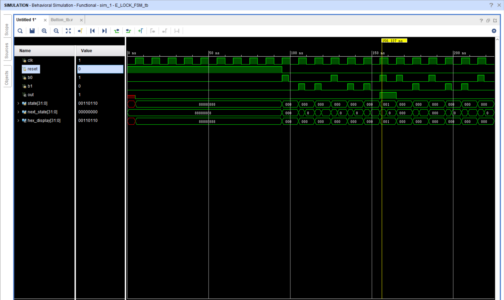

    现象描述：状态机工作正常，结果符合预期

4. 写下整个设计的 Verilog 描述，并在开发板中进行测试

    1) verilog描述

        ```Verilog
        `timescale 1ns / 1ps

        // 顶层模块
        module Lock(
            input clk, reset,
            input b0_in, b1_in,
            output [6:0] a_to_g0,
            output [6:0] a_to_g1,
            output [7:0] an,
            output reg unlock
            );
            // 处理按钮输入
            wire b0, b1;
            Button b_0(.clk(clk), .reset(reset), .button_in(b0_in), .button_out(b0));
            Button b_1(.clk(clk), .reset(reset), .button_in(b1_in), .button_out(b1));

            // 状态机
            wire out;
            wire [31:0] hex;
            E_LOCK_FSM lock_fsm(.clk(clk), .reset(reset), .b0(b0), .b1(b1), .out(out), .hex_display(hex));
            
            // 七段数码管
            Hex7seg h(.clk(clk), .reset(reset), .hex(hex), .a_to_g0(a_to_g0), .a_to_g1(a_to_g1), .an(an));
            
            // 解锁
            always @(posedge reset) unlock <= out;

            // 根据之前的经验，我们还可以采用以下代码：
            // reg out_old;
            // always @(posedge clk) begin
            //     if (out == 0 && out_old == 1)
            //         unlock <= ~unlock;
            //     out_old <= out;
            // end
            // 从而与时钟信号同步
        endmodule

        // 按钮模块
        module Button(
            input clk, reset, button_in,
            output button_out
            );

            // 两级触发器，消除亚稳态
            reg button, btemp;
            always @ (posedge clk) begin
                {button, btemp} <= {btemp, button_in};
            end

            wire bpressed;
            // 按键去抖动
            debounce d1(
                .reset(reset),
                .clk(clk),
                .noisy(button),
                .clean(bpressed)
            );

            // 脉宽变换
            reg q;
            assign button_out = bpressed & ~q;
            always @ (posedge clk) begin
                q <= bpressed;
            end
        endmodule

        module debounce(
            input reset, clk, noisy,
            output reg clean
            );

            parameter NDELAY = 650000;
            parameter NBITS = 20;

            reg [NBITS-1:0] count;
            reg xnew;

            always @ (posedge clk) begin
                if (reset) begin
                    xnew <= noisy;
                    clean <= noisy;
                    count <= 0;
                end else if (noisy != xnew) begin
                    xnew <= noisy;
                    count <= 0;
                end else if (count == NDELAY) begin
                    clean <= xnew;
                end else begin
                    count <= count + 1;
                end
            end
        endmodule

        // 状态机模块
        module E_LOCK_FSM(
            input clk, reset,
            input b0, b1,
            output out,
            output [31:0] hex_display
            );
            // 定义状态
            parameter S_RESET = 32'h11111111;
            parameter S_0 = 32'h00000000;
            parameter S_01 = 32'h00000001;
            parameter S_011 = 32'h00000011;
            parameter S_0110 = 32'h00000110;
            parameter S_01101 = 32'h00001101;
            parameter S_011011 = 32'h00011011;
            parameter S_0110110 = 32'h00110110;

            reg [31:0] state, next_state;
            // 次态逻辑
            always @(*) begin
                if (reset)
                    next_state = S_RESET;
                else
                    case (state)
                        S_RESET: next_state = b0 ? S_0 : b1 ? S_RESET : state;
                        S_0: next_state = b0 ? S_0 : b1 ? S_01 : state;
                        S_01: next_state = b0 ? S_0 : b1 ? S_011 : state;
                        S_011: next_state = b0 ? S_0110 : b1 ? S_RESET : state;
                        S_0110: next_state = b0 ? S_0 : b1 ? S_01101 : state;
                        S_01101: next_state = b0 ? S_0 : b1 ? S_011011 : state;
                        S_011011: next_state = b0 ? S_0110110 : b1 ? S_RESET : state;
                        S_0110110: next_state = b0 ? S_0 : b1 ? S_01101 : state;
                        default: next_state = S_RESET;
                    endcase
            end

            // 现态赋值
            always @(posedge clk) state <= next_state;
            
            //输出
            assign out = (state == S_0110110);
            assign hex_display = state;
        endmodule

        // 七段数码管模块
        module Hex7seg(
            input clk,
            input reset,
            input [31:0] hex,
            output [6:0] a_to_g0,
            output [6:0] a_to_g1,
            output [7:0] an
            );

            Hex7segIndex hex7segindex0(
                .hex(hex[15:0]),
                .clk(clk),
                .reset(reset),
                .a_to_g(a_to_g0),
                .an(an[3:0])
            );
            
            Hex7segIndex hex7segindex1(
                .hex(hex[31:16]),
                .clk(clk),
                .reset(reset),
                .a_to_g(a_to_g1),
                .an(an[7:4])
            );

        endmodule

        module Hex7segIndex(
            input [15:0] hex,
            input clk,
            input reset,
            output reg [6:0] a_to_g,
            output reg [3:0] an
            );

            wire [1:0] s;
            reg [3:0] digit;
            reg [19:0] clkdiv;
            assign s = clkdiv[19:18];

            always @ (*) begin
                case (s)
                    2'b00: digit = hex[3:0];
                    2'b01: digit = hex[7:4];
                    2'b10: digit = hex[11:8];
                    2'b11: digit = hex[15:12];
                    default: digit = hex[3:0];
                endcase
            end

            always @(*) begin
                case (digit)
                    4'b0000: a_to_g = 7'b1111110;
                    4'b0001: a_to_g = 7'b0110000;
                    4'b0010: a_to_g = 7'b1101101;
                    4'b0011: a_to_g = 7'b1111001;
                    4'b0100: a_to_g = 7'b0110011;
                    4'b0101: a_to_g = 7'b1011011;
                    4'b0110: a_to_g = 7'b1011111;
                    4'b0111: a_to_g = 7'b1110000;
                    4'b1000: a_to_g = 7'b1111111;
                    4'b1001: a_to_g = 7'b1111011;
                    4'b1010: a_to_g = 7'b1110111;
                    4'b1011: a_to_g = 7'b0011111;
                    4'b1100: a_to_g = 7'b1001111;
                    4'b1101: a_to_g = 7'b0111101;
                    4'b1110: a_to_g = 7'b1001111;
                    4'b1111: a_to_g = 7'b1000111;
                    default: a_to_g = 7'b0000000;
                endcase
            end
            
            always @ (*) begin
                an = 4'b0000;
                an[s] = 1;
            end
                
            always @ (posedge clk or posedge reset) begin
                if (reset)
                    clkdiv <= 0;
                else
                    clkdiv <= clkdiv + 1;
            end
        endmodule
        ```

    2) 仿真测试代码

        ```verilog
        `timescale 1ns / 1ps

        module Lock_tb;
            reg clk;
            reg reset;
            reg b0_in;
            reg b1_in;

            wire [6:0] a_to_g0;
            wire [6:0] a_to_g1;
            wire [7:0] an;
            wire unlock;

            Lock uut (.clk(clk), .reset(reset), .b0_in(b0_in), .b1_in(b1_in), .a_to_g0(a_to_g0), .a_to_g1(a_to_g1), .an(an), .unlock(unlock));

            initial begin
                // 初始化输入信号
                clk = 0;
                reset = 1;
                b0_in = 0;
                b1_in = 0;

                #100;
                reset = 0;

                // 测试1：简单的按钮按下和释放
                b0_in = 1; #100; b0_in = 0; #100;
                b1_in = 1; #100; b1_in = 0; #100;
                b0_in = 1; #100; b0_in = 0; #100;
                b1_in = 1; #100; b1_in = 0; #100;
                b0_in = 1; #100; b0_in = 0; #100;
                b1_in = 1; #100; b1_in = 0; #100;

                // 测试2：另一组按钮按下序列
                b0_in = 1; #200; b0_in = 0; #200;
                b1_in = 1; #200; b1_in = 0; #200;
                b0_in = 1; #200; b0_in = 0; #200;
                b1_in = 1; #200; b1_in = 0; #200;
                b0_in = 1; #200; b0_in = 0; #200;
                b1_in = 1; #200; b1_in = 0; #200;

                // 测试3：快速连续的按钮按下
                repeat (3) begin
                    b0_in = 1; #50; b0_in = 0; #50;
                    b1_in = 1; #50; b1_in = 0; #50;
                end

                // 测试4：长时间按下按钮
                b0_in = 1; #500; b0_in = 0; #100;
                b1_in = 1; #500; b1_in = 0; #100;

                // 测试5：短时间按下按钮
                b0_in = 1; #20; b0_in = 0; #100;
                b1_in = 1; #20; b1_in = 0; #100;

                // 测试6：密码序列 0110110
                b0_in = 1; #200; b0_in = 0; #200; // 0
                b1_in = 1; #200; b1_in = 0; #200; // 1
                b1_in = 1; #200; b1_in = 0; #200; // 1
                b0_in = 1; #200; b0_in = 0; #200; // 0
                b1_in = 1; #200; b1_in = 0; #200; // 1
                b1_in = 1; #200; b1_in = 0; #200; // 1
                b0_in = 1; #200; b0_in = 0; #200; // 0
            end
            
            always #5 clk = ~clk; // 生成时钟信号

        endmodule
        ```

    3) 仿真测试结果
    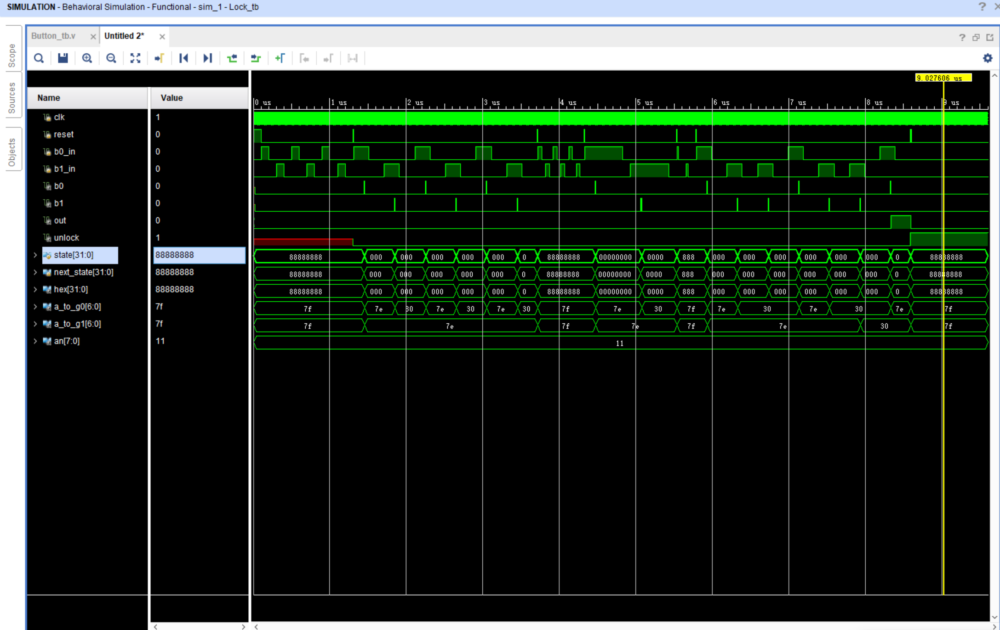
    输出信号符合预期

    4) 开发板测试结果
    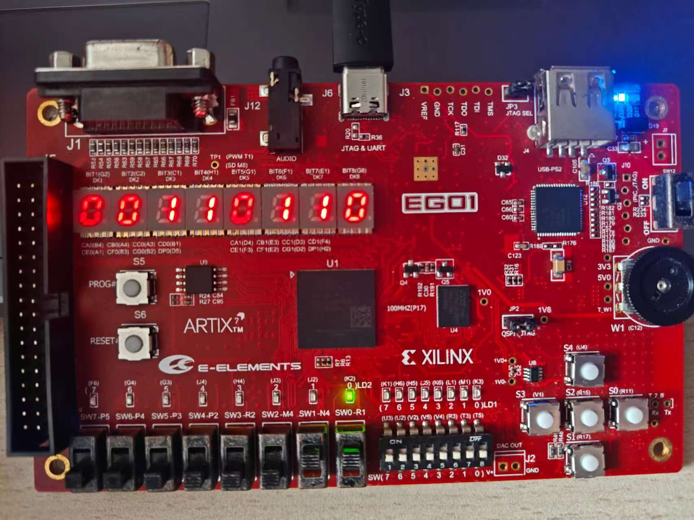
    开发板工作正常，按钮输出稳定

5. 手动计算 FSM，以仅使用D触发器和and/OR/NOT门绘制FSM的电路

    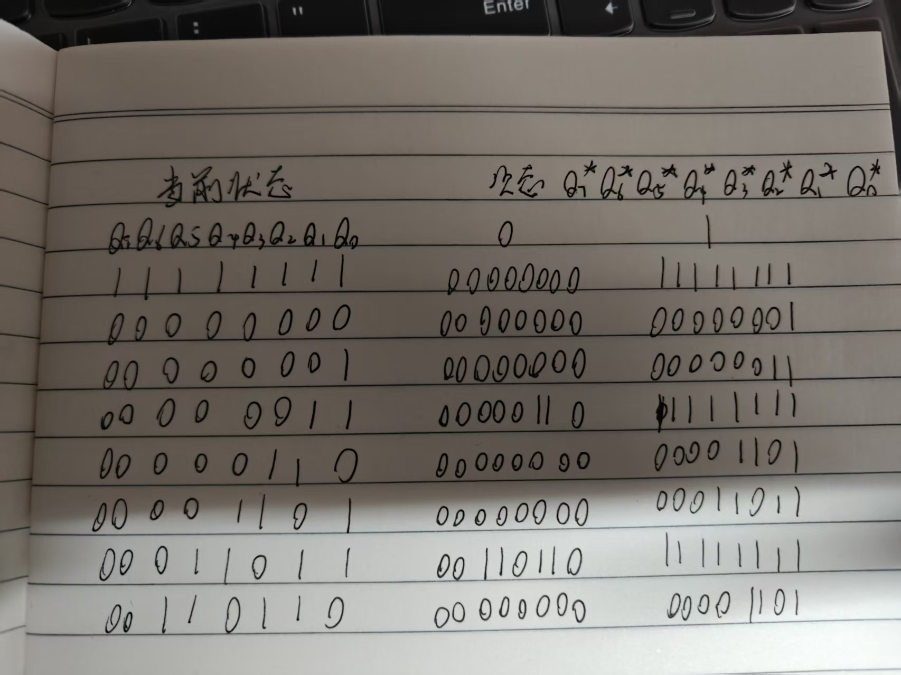
    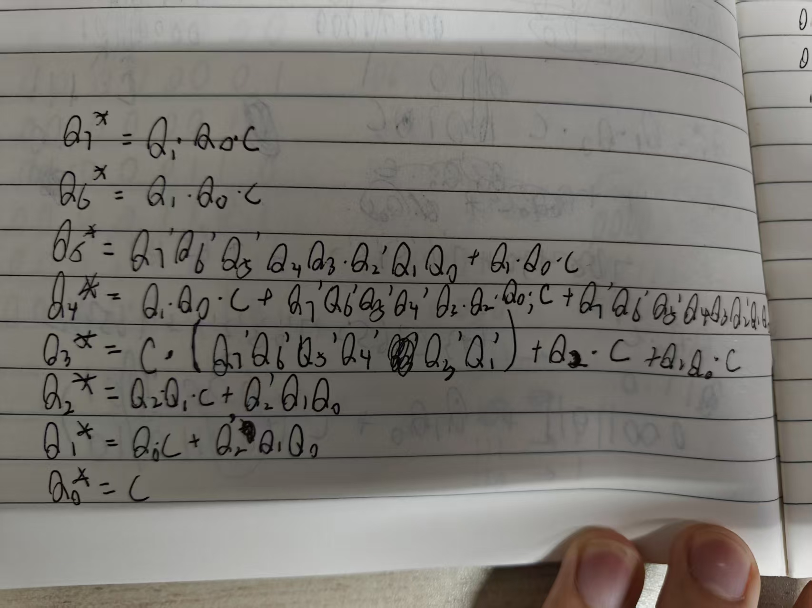
    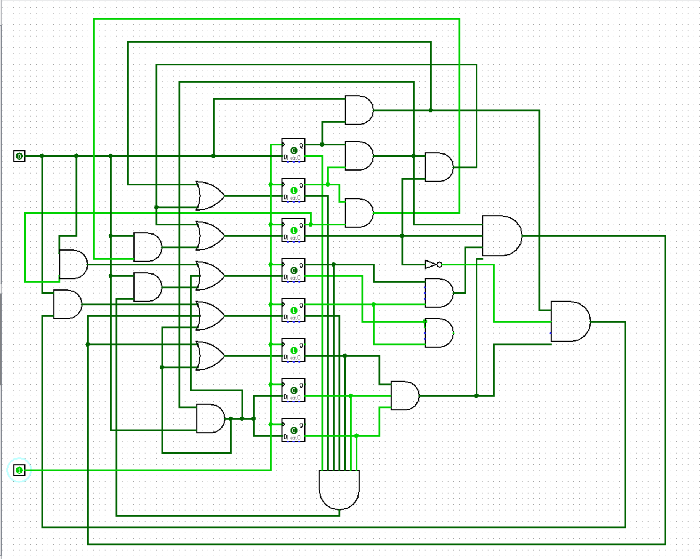

6. 根据自己计算的FSM电路图，编写FSM的Verilog模块：对于下一个状态逻辑和输出逻辑，使用“assign”语句来描述组合逻辑，对于D触发器，使用“always”语句来进行描述。

    ```verilog
    module main(input C, input clk);
        // 定义所有信号变量
        wire net0, net1, net2, net3, net4, net5, net6, net7, net8, net9;
        wire net10, net11, net12, net13, net14, net15, net16, net17, net18, net19;
        wire net20, net21, net22, net23, net24, net25, net26, net27, net28, net29;
        wire net30, net31, net32, net33, net34, net35;

        // 输入连接
        assign net1 = clk;
        assign net5 = C;

        // 非门
        not (net24, net13);

        // 与门
        and (net0, net5, net4);
        and (net33, net5, net12);
        and (net18, net5, net28);
        and (net15, net23, net5);
        and (net30, net5, net11);
        and (net7, net5, net22);
        and (net12, net7, net24, net10);
        and (net10, net9, net2, net16);
        and (net25, net27, net20);
        and (net29, net23, net13);
        and (net23, net22, net14);
        and (net28, net14, net4);

        // 或门
        or (net31, net8, net15);
        or (net3, net7, net29);
        or (net26, net29, net18);
        or (net34, net0, net15, net30);
        or (net19, net33, net8, net15);

        // 触发器
        always @(posedge net1) begin
            net22 <= net5; // D0
        end
        assign net21 = ~net22;

        always @(posedge net1) begin
            net14 <= net3; // D1
        end
        assign net32 = ~net14;

        always @(posedge net1) begin
            net4 <= net26; // D2
        end
        assign net13 = ~net4;

        always @(posedge net1) begin
            net27 <= net34; // D3
        end
        assign net6 = ~net27;

        always @(posedge net1) begin
            net20 <= net19; // D4
        end
        assign net17 = ~net20;

        always @(posedge net1) begin
            net9 <= ~net31; // D5
        end

        always @(posedge net1) begin
            net2 <= ~net15; // D6
        end

        always @(posedge net1) begin
            net16 <= ~net15; // D7
        end

    endmodule
    ```

7. 对于整个设计，将步骤2）中设计的FSM模块替换为步骤6）中设计，并在板中实现整个设计

    ```verilog
    `timescale 1ns / 1ps
    
    module Lock(
        input clk, reset,
        input b0_in, b1_in,
        output [6:0] a_to_g0,
        output [6:0] a_to_g1,
        output [7:0] an,
        output reg unlock
        );
        // 处理按钮输入
        wire b0, b1;
        Button b_0(.clk(clk), .reset(reset), .button_in(b0_in), .button_out(b0));
        Button b_1(.clk(clk), .reset(reset), .button_in(b1_in), .button_out(b1));
    
        // 状态机
        wire out;
        wire [31:0] hex;
        E_LOCK_FSM lock_fsm(.clk(clk), .reset(reset), .b0(b0), .b1(b1), .out(out), .hex_display(hex));
        
        // 七段数码管
        Hex7seg h(.clk(clk), .reset(reset), .hex(hex), .a_to_g0(a_to_g0), .a_to_g1(a_to_g1), .an(an));
        
        // 解锁
        always @(posedge reset) unlock <= out;
        //reg out_old;
        //always @(posedge clk) begin
        //    if (out == 0 && out_old == 1)
        //        unlock <= ~unlock;
        //    out_old <= out;
        //end
    endmodule
    
    module E_LOCK_FSM(
        input clk, reset,
        input b0, b1,
        output out,
        output [31:0] hex_display
    );
        C = b0 ? 0 : b1 ? 1 : C;
    
        // 所有信号变量
        reg net0, net1, net2, net3, net4, net5, net6, net7, net8, net9;
        reg net10, net11, net12, net13, net14, net15, net16, net17, net18, net19;
        reg net20, net21, net22, net23, net24, net25, net26, net27, net28, net29;
        reg net30, net31, net32, net33, net34, net35;
    
        // 输入连接
        assign net1 = clk;
        assign net5 = C;
        assign {net16, net2, net9, net20, net27, net4, net14, net22} = reset ? 8'b00000000 : 
        {net16, net2, net9, net20, net27, net4, net14, net22};
    
        // 非门
        not (net24, net13);
    
        // 与门
        and (net0, net5, net4);
        and (net33, net5, net12);
        and (net18, net5, net28);
        and (net15, net23, net5);
        and (net30, net5, net11);
        and (net7, net5, net22);
        and (net12, net7, net24, net10);
        and (net10, net9, net2, net16);
        and (net25, net27, net20);
        and (net29, net23, net13);
        and (net23, net22, net14);
        and (net28, net14, net4);
    
        // 或门
        or (net31, net8, net15);
        or (net3, net7, net29);
        or (net26, net29, net18);
        or (net34, net0, net15, net30);
        or (net19, net33, net8, net15);
    
        // 触发器（按照 D 后数字从小到大排序）
        always @(posedge net1) begin
            net22 <= net5; // D0
        end
        assign net21 = ~net22;
    
        always @(posedge net1) begin
            net14 <= net3; // D1
        end
        assign net32 = ~net14;
    
        always @(posedge net1) begin
            net4 <= net26; // D2
        end
        assign net13 = ~net4;
    
        always @(posedge net1) begin
            net27 <= net34; // D3
        end
        assign net6 = ~net27;
    
        always @(posedge net1) begin
            net20 <= net19; // D4
        end
        assign net17 = ~net20;
    
        always @(posedge net1) begin
            net9 <= ~net31; // D5
        end
    
        always @(posedge net1) begin
            net2 <= ~net15; // D6
        end
    
        always @(posedge net1) begin
            net16 <= ~net15; // D7
        end
    
        // 输出
        assign state = {~net16, ~net2, ~net9, net20, net27, net4, net14, net22};
        assign out = (state == 8'b01101100);
        assign hex_display = {3'b000,state[7],3'b000,state[6],3'b000,state[5],3'b000,state[4],3'b000,state[3],3'b000,state[2],3'b000,state[1],3'b000,state[0]};
    endmodule

## 三. 实验心得

通过这次实验，我充分学习了将软件和硬件结合起来思考，合理设计电路结构的方法，我们不仅要考虑电路逻辑的通顺，还要考虑物理世界中的真实情况，这是一个非常累也非常有趣的过程。
